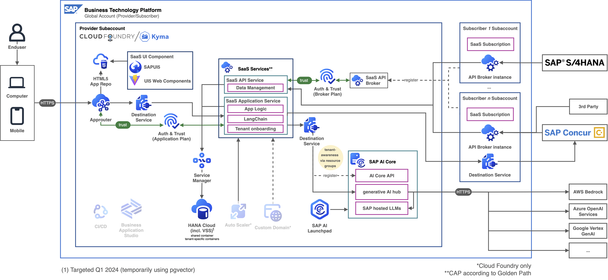
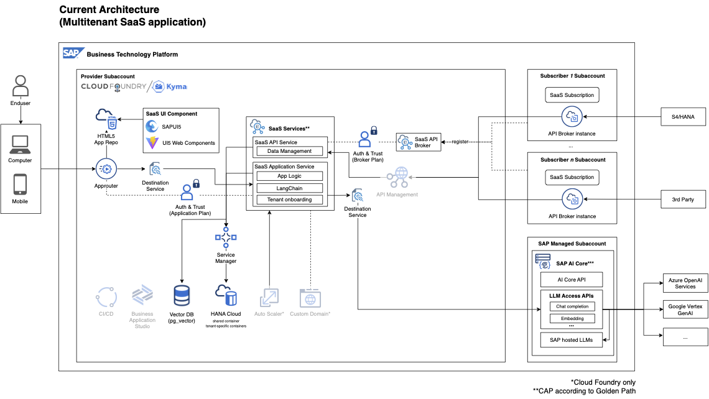

# Develop a CAP-based multitenant Software as a Service application using SAP AI Services in SAP BTP using Retrieval Augmented Generation (RAG) architecture

[](https://api.reuse.software/info/github.com/SAP-samples/btp-cap-multitenant-ai)

Further details will follow soon!

Repo to be moved to https://github.com/SAP-samples/ prior to TechEd 2023

## Description

Welcome to our dedicated GitHub repository, designed to provide valuable support to developers, partners and customers aiming to create advanced **GenAI** solutions on **SAP Business Technology Platform (SAP BTP)**. Inside, you'll find a carefully crafted example that follows SAP BTP's respected Golden Path development approach. We've covered both [single-tenant and multitenant (Software as a Service, SaaS) versions](#versions) to suit different needs. Discover how to smoothly integrate different **Large Language Models (LLMs)** via SAP AI Core, make the most of LangChain in CAP and use advanced techniques like output parsing according a custom schema or **Retrieval Augmented Generation (RAG)** through embeddings and a vector database to achieve even higher value for your use case. Notably, our repository supports two runtimes, Cloud Foundry and Kyma, offering flexibility in your journey to harness GenAI on SAP BTP.

## Use Case of the Reference Application: Multi-Tenant GenAI-powered Inbox Insights and Support

The provided code sample presents a multitenant application crafted by a potential SAP partner or customer, tailored for SAP Business Technology Platform (SAP BTP). This scenario presents a comprehensive SaaS solution for enhancing customer support within a travel agency, utilizing advanced email insights and automation. The system analyzes incoming emails using Large Language Models (LLMs) to offer core insights such as categorization, sentiment analysis and urgency assessment. It goes beyond basic analysis by extracting key facts and customizable fields like location, managed through a dedicated configuration page.

One innovative feature involves utilizing email embeddings to identify similar historical emails, aiding in understanding how similar requests were handled previously. This fosters consistent and efficient customer service. The code also demonstrates the capabilities of summarizing and translating both email subject and body, enabling streamlined comprehension across languages.

Furthermore, the system takes automation to the next level by generating potential responses for customer inquiries. This response generation is influenced by configurable actions and services, enhancing response accuracy and speed. The flexibility to connect with SAP systems like SAP Concur adds an enterprise dimension, allowing seamless integration of processes and data.

Though initially tailored for a travel agency, the code can be adapted to suit various industries, making it a versatile solution for augmenting customer support with data-driven insights and automation.

## Architectures

<p align="center">
    
    <em>Target Architecture: Multitenant SaaS application</em>
</p>

<details>
<summary>Further architectures (current, single tenant)</summary>
<p align="center">
    
    <em>Multitenant SaaS application (current)</em>
</p>
<p align="center">
    
    <em>Single tenant application (target)</em>
</p>
<p align="center">
    
    <em>Single tenant application (current)</em>
</p>
</details>

## Versions

- Multitenant: [Develop a CAP-based multitenant Software as a Service application using SAP AI Services and GenAI in SAP BTP using Retrieval Augmented Generation (RAG) architecture](https://github.tools.sap/btp-use-case-factory/btp-cap-multitenant-ai)
- Single tenant: [Develop a CAP-based single tenant application using SAP AI Services and GenAI in SAP BTP using Retrieval Augmented Generation (RAG) architecture](https://github.tools.sap/btp-use-case-factory/btp-cap-singletenant-ai)

## Local testing

```
cf csk dev-aisaas-uaa dev-aisaas-uaa-key
cf csk dev-aisaas-aicore dev-aisaas-aicore-key
cf csk dev-aisaas-credstore dev-aisaas-credstore-key
cf csk dev-aisaas-registry dev-aisaas-registry-key
cf csk dev-aisaas-destination dev-aisaas-destination-key
cf csk dev-aisaas-service-manager dev-aisaas-service-manager-key
cf csk dev-aisaas-com-hdi-container dev-aisaas-com-hdi-container-key
cf csk dev-aisaas-service-manager-admin dev-aisaas-service-manager-admin-key

cds bind -2 dev-aisaas-destination,dev-aisaas-uaa --for hybrid --output-file .cdsrc-private.json
cds bind hana -2 dev-aisaas-com-hdi-container --kind hana --for hybrid --output-file .cdsrc-private.json
cds bind credstore -2 dev-aisaas-credstore --kind credstore --for hybrid --output-file .cdsrc-private.json
cds bind saas-registry -2 dev-aisaas-registry --kind saas-registry --for hybrid --output-file .cdsrc-private.json
cds bind sm-container -2 dev-aisaas-service-manager --kind service-manager --for hybrid --output-file .cdsrc-private.json
cds bind sm-admin -2 dev-aisaas-service-manager-admin --kind service-manager --for hybrid --output-file .cdsrc-private.json
```

## How to obtain support

[Create an issue](https://github.com/SAP-samples/btp-cap-multitenant-ai/issues) in this repository if you find a bug or have questions about the content.

For additional support, [ask a question in SAP Community](https://answers.sap.com/questions/ask.html).

## Contributing

If you wish to contribute code, offer fixes or improvements, please send a pull request. Due to legal reasons, contributors will be asked to accept a DCO when they create the first pull request to this project. This happens in an automated fashion during the submission process. SAP uses [the standard DCO text of the Linux Foundation](https://developercertificate.org/).

## License

Copyright (c) 2022 SAP SE or an SAP affiliate company. All rights reserved. This project is licensed under the Apache Software License, version 2.0 except as noted otherwise in the [LICENSE](LICENSE) file.
