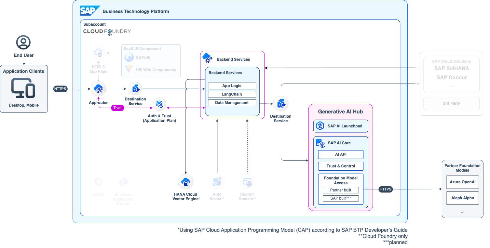

## CAP with Generative AI Hub & SAP HANA Cloud Vector Engine

**BASIC CODING FOR LLM ACCESS AND SIMILARITY SEARCH ON SAP BUSINESS TECHNOLOGY PLATFORM**

In this scenario, we provide a practical demonstration using a minimal amount of boilerplate code to fullfill the [Reference Architecture for GenAI and RAG on SAP BTP](https://discovery-center.cloud.sap/refArchDetail/ref-arch-open-ai) in a single-tenant mode. Our aim is to exemplify the utilization of CAP (Cloud Application Programming Model), LLMs (Large Language Models) and Embedding Models through Generative AI Hub in SAP AI Core. This setup empowers us to conduct a Similarity Search, leveraging the capabilities offered by the SAP HANA Cloud Vector Engine.

<p align="center">
    
    <em>Instance of Reference Architecture for GenAI and RAG on SAP BTP (single-tenant)</em>
</p>

### PREREQUISITES

- Cloud Foundry Subaccount
- Access to generative AI hub (SAP AI Core with service plan `extended`)
- Access to SAP HANA Cloud Vector Engine (pre-release on canary landscape)

### PREPARE FOR DEPLOYMENT

1. [Create an instance of SAP AI Core ](https://help.sap.com/docs/sap-ai-core/sap-ai-core-service-guide/create-service-instance) and make sure to choose the service plan `extended` to activate Generative AI Hub and continue [creating a Service Key](https://help.sap.com/docs/sap-ai-core/sap-ai-core-service-guide/create-service-key)

2. [Create a Destination](https://help.sap.com/docs/btp/sap-business-technology-platform/create-destination) for Generative AI Hub in the SAP BTP Cockpit of your Subaccount based on the Service Key of SAP AI Core you created in the previous step:

   ```yaml
   Name: GENERATIVE_AI_HUB
   Description: SAP AI Core deployed service (generative AI hub)
   URL: <AI-API-OF-AI-CORE-SERVICE-KEY>/v2 # make sure to add /v2!
   URL.headers.AI-Resource-Group: default # adjust if necessary
   URL.headers.Content-Type: application/json
   Type: HTTP
   ProxyType: Internet
   Authentication: OAuth2ClientCredentials
   tokenServiceURL: <TOKEN-SERVICE-URL-OF-AI-CORE-SERVICE-KEY>/oauth/token
   clientId: <YOUR-CLIENT-ID-OF-AI-CORE-SERVICE-KEY>
   clientSecret: <YOUR-CLIENT-SECRET-OF-AI-CORE-SERVICE-KEY>
   HTML5.DynamicDestination: true
   ```

3. [Create SAP HANA Cloud](https://help.sap.com/docs/HANA_CLOUD_ALIBABA_CLOUD/683a53aec4fc408783bbb2dd8e47afeb/7d4071a49c204dfc9e542c5e47b53156.html) with Vector Engine (pre-release QRC 1/2024 or later (on canary))

### DEPLOYMENT

1. Dupliate `api/.cdsrc.json.sample` to `api/.cdsrc.json` and enter the Deployment IDs for the created ChatCompletion and Embedding model. Adjust the Resource Group if necessary.
2. Run `npm run build` or `yarn build` on CLI to build the MTA
3. Run `npm run deploy` or `yarn deploy` on CLI to deploy the API to your Subaccount

### DEVELOPMENT

After succesful deployment, we can develop based on the created service instances on SAP BTP.

1. Run `npm install` or `yarn install` to install project specific dependencies
2. Login to your subaccount with [Cloud Foundry CLI](https://docs.cloudfoundry.org/cf-cli/install-go-cli.html), running `cf login`
3. [Bind services for hybrid testing](https://cap.cloud.sap/docs/advanced/hybrid-testing) and development (create Service Keys if necessary).

   ```bash
   cd api # make sure to execute in the api directory
   cds bind -2 genaihub-vectorengine-sample-uaa
   cds bind -2 genaihub-vectorengine-sample-destination
   cds bind -2 genaihub-vectorengine-sample-hdi-container
   ```

   After the services are bound successfuly, `api/.cdsrc-private.json` should exist with the `hybrid` profile.

4. Run`npm run watch:api` or `yarn watch:api` from project root to start CAP backend.
5. Duplicate `api/test/requests.sample.http` to `api/test/requests.http` and enter UAA details from the Service Key of the `genaihub-vectorengine-sample-uaa` instance to execute the requests.

#### if UI is attached (tbd)

1. Duplicate `router/dev/default-services.sample.json` to `router/dev/default-services.json` and enter UAA details from the Service Key of the `genaihub-vectorengine-sample-uaa` instance.
2. Run `npm run watch` or `yarn watch` from project root to start the Approuter and CAP backend.

### MANUAL CDS DEPLOYMENT TO SAP HANA CLOUD

1. Duplicate `api/default-env.sample.json` to `api/default-env.json` and enter the credentials from the Service Key of the `genaihub-vectorengine-sample-hdi-container` instance
2. Run `cds deploy -2 hana` in `api`
