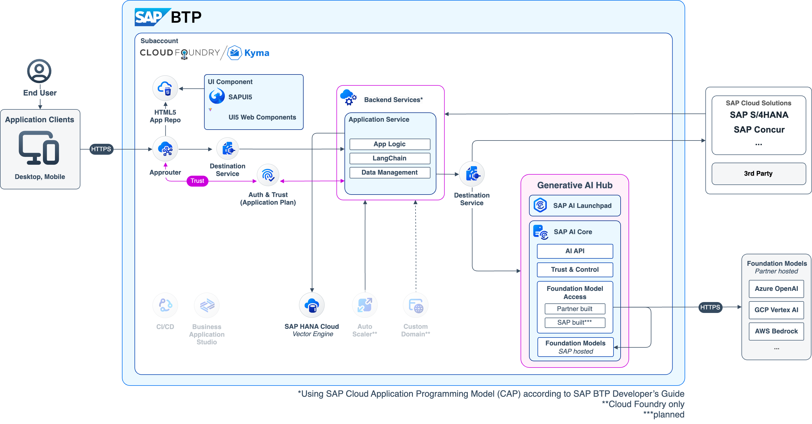
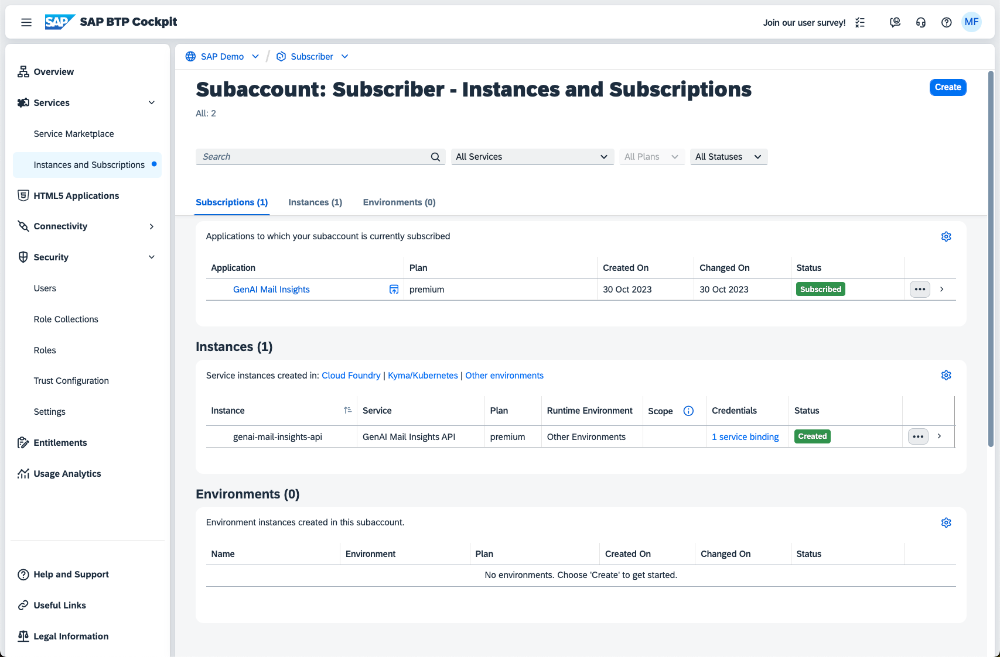
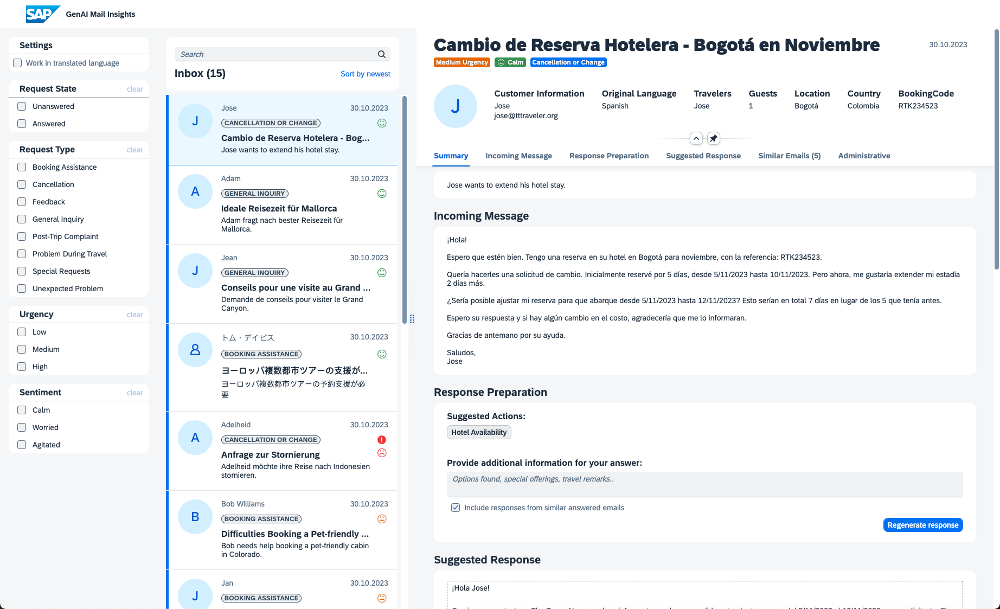
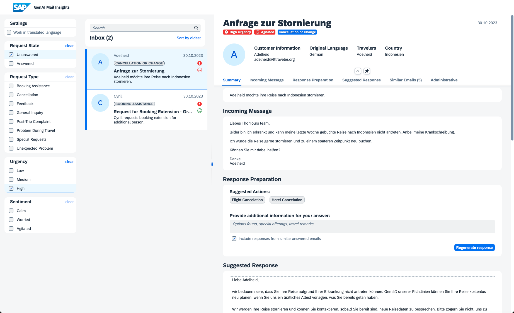
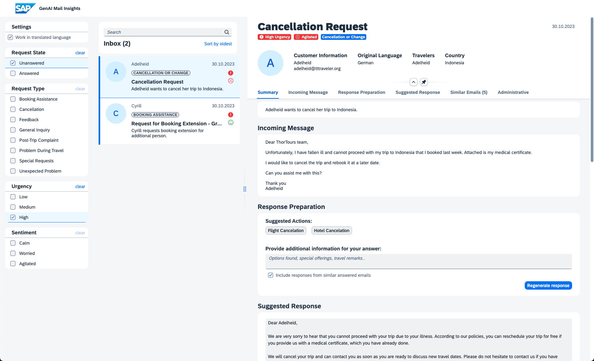
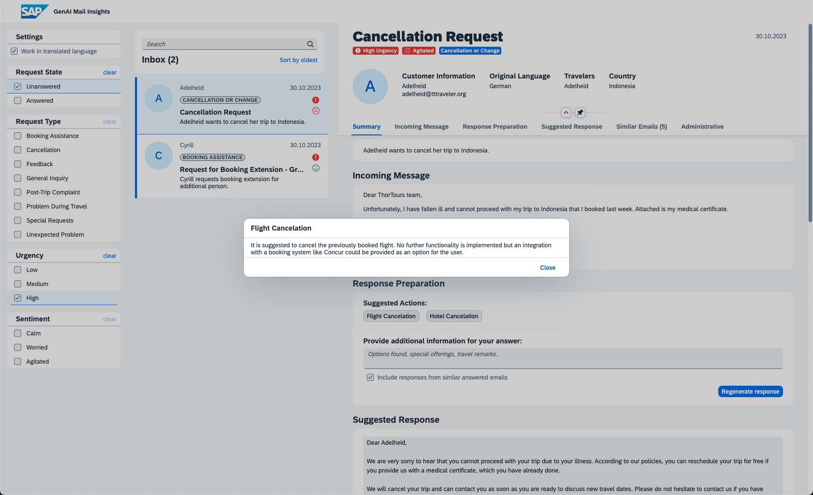
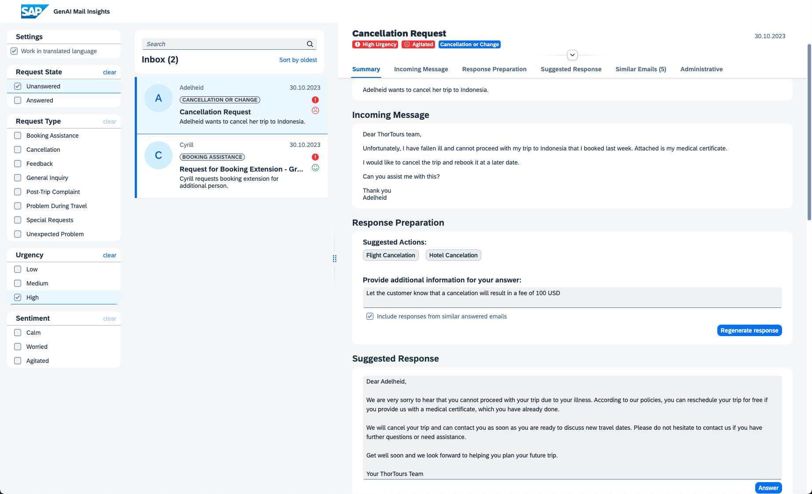
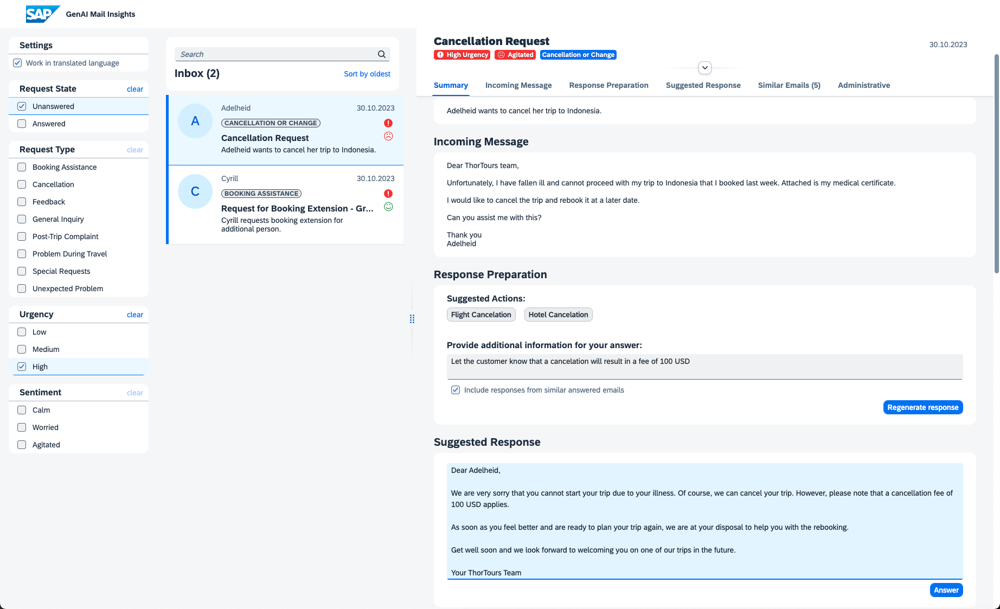
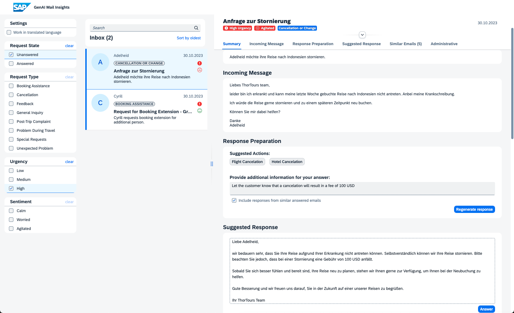
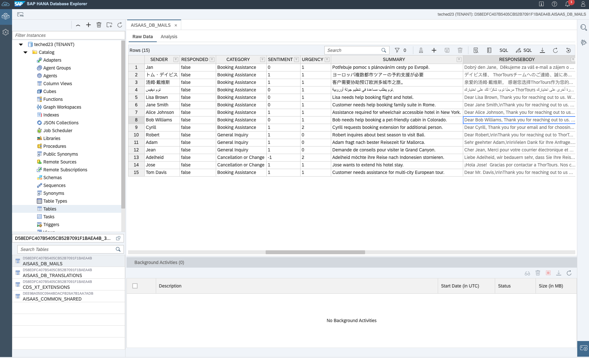

# GenAI Mail Insights - Develop a CAP-based application using GenAI and RAG on SAP BTP

Welcome to our dedicated GitHub repository, designed to provide valuable support to developers, partners and customers aiming to create advanced **GenAI** solutions on **SAP Business Technology Platform (SAP BTP)** following the **Reference Architecture**. Inside, you'll find a carefully crafted example that follows SAP BTP's respected Golden Path development approach. Discover how to smoothly integrate different **Foundation Models** and **Large Language Models (LLMs)** via **Generative AI Hub** by SAP AI Core, make the most of LangChain in CAP and use advanced techniques like output parsing according a custom schema or **Retrieval Augmented Generation (RAG)** through embeddings and **SAP HANA Cloud's Vector Engine** to achieve even higher value for your use case.

We encourage you to check out our accompanying Discovery Center Mission [Develop a CAP-based application using GenAI and RAG](https://discovery-center.cloud.sap/missiondetail/4371/) along with the corresponding reference architecture guidance for [Retrieval Augmented Generation with GenAI on SAP BTP](https://discovery-center.cloud.sap/refArchDetail/ref-arch-open-ai). To learn more about Generative AI at SAP, we highly recommend to visit [this openSAP course](https://open.sap.com/courses/genai1).

**Basic Sample**:
For a more lightweight, basic backend-only sample of this Reference Architecture including _CAP_, _generative AI hub_ and _SAP HANA Cloud's Vector Engine_, please check out the separate branch specifically dedicated to the basic boilerplate sample: [cap-genaihub-vectorengine-sample](https://github.com/SAP-samples/btp-cap-genai-rag/tree/cap-genaihub-vectorengine-sample).

 

    
    <em>Architecture: GenAI application with RAG on SAP BTP</em>

## Business Use Case of the Reference Application

The [provided code sample](./single-tenant) presents a application crafted by a potential SAP partner or customer, tailored for SAP Business Technology Platform (SAP BTP). This scenario presents a comprehensive solution for enhancing customer support within a travel agency, utilizing advanced email insights and automation. The system analyzes incoming emails using Large Language Models (LLMs) to offer core insights such as categorization, sentiment analysis and urgency assessment. It goes beyond basic analysis by extracting key facts and customizable fields like location, managed through a dedicated configuration page.

One innovative feature involves utilizing email embeddings to identify similar historical emails, aiding in understanding how similar requests were handled previously. This fosters consistent and efficient customer service. The code also demonstrates the capabilities of summarizing and translating both email subject and body, enabling streamlined comprehension across languages.

Furthermore, the system takes automation to the next level by generating potential responses for customer inquiries. This response generation is influenced by configurable actions and services, enhancing response accuracy and speed. The flexibility to connect with SAP systems like SAP Concur adds an enterprise dimension, allowing seamless integration of processes and data.

Though initially tailored for a travel agency, the code can be adapted to suit various industries, making it a versatile solution for augmenting customer support with data-driven insights and automation.

The business scenario can also be enhanced to become a multitenant SaaS solution.

> **Insight:** If the concept of multitenancy in SAP BTP is new to you, we strongly suggest perusing the following GitHub repository to gain a deeper understanding of deploying a CAP-based multitenant application in the SAP BTP, Kyma Runtime, as well as the SAP BTP, Cloud Foundry Runtime.  [Explore the development of a multitenant Software as a Service application in SAP BTP using CAP](https://github.com/SAP-samples/btp-cap-multitenant-saas)

## Impressions of the Reference Application

- [Blog post about GenAI Mail Insights by Martin Frick](https://blogs.sap.com/2023/11/15/genai-mail-insights-leveraging-the-generative-ai-hub-in-sap-ai-core-to-improve-customer-support/)
- [Video about GenAI Mail Insights by Adi Pleyer](https://sapvideo.cfapps.eu10-004.hana.ondemand.com/?entry_id=1_uq2ma82t)

## Getting started

This sample scenario comes with a step-by-step tutorial for a deployment in your own SAP BTP landscape. Check the following chapters and setup the scenario step-by-step in your own environment. The guide covers the deployment of the single-tenant as well as the multitenant version of the application.

1. [Scenario Introduction](./docs/tutorial/1-intro/README.md)
2. [Landscape Setup](./docs/tutorial/2-setup/README.md)
3. [Scenario Deployment](./docs/tutorial/3-deploy/README.md)
4. [Application Testing](./docs/tutorial/4-test/README.md)
5. [Extend the solution](./docs/tutorial/5-extend/README.md)

## How to obtain support

[Create an issue](https://github.com/SAP-samples/btp-cap-genai-rag/issues) in this repository if you find a bug or have questions about the content.

For additional support, [ask a question in SAP Community](https://answers.sap.com/questions/ask.html).

## Known Issues, Open Tasks and Additional Details

- **Error during paketo build process**
  - Description: The **cap-js/sqlite** package is currently not part of the dependencies as it causes issues during the paketo build process.
  - Workaround: Install the **cap-js/sqlite** package manually without saving it in your package dependencies by running - **npm i @cap-js/sqlite --no-save** in the _/(multi/single)-tenant/code_ directory.

## Contributing

Thanks to all collaborators to make this application real!

- [Adi Pleyer](https://github.com/AdiPleyer)
- [Iyad Al Hafez](https://github.com/Iyad-Alhafez)
- [Julian Schambeck](https://github.com/julian-schambeck)
- [Kay Schmitteckert](https://github.com/kay-schmitteckert)
- [Martin Frick](https://github.com/martinfrick)
- Karen Detken
- Hyun Lee

If you wish to contribute code, offer fixes or improvements, please send a pull request. Due to legal reasons, contributors will be asked to accept a DCO when they create the first pull request to this project. This happens in an automated fashion during the submission process. SAP uses [the standard DCO text of the Linux Foundation](https://developercertificate.org/).

## License

Copyright (c) 2023 SAP SE or an SAP affiliate company. All rights reserved. This project is licensed under the Apache Software License, version 2.0 except as noted otherwise in the [LICENSE](LICENSE) file.
