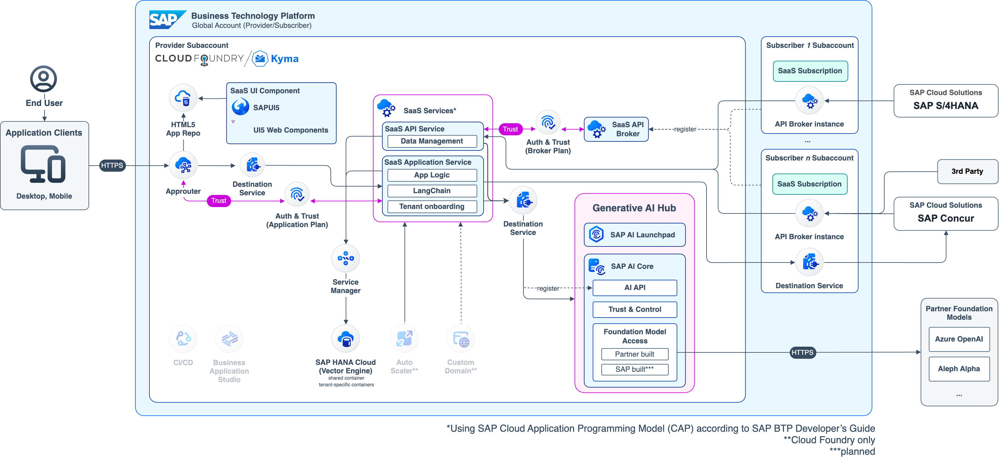

# Develop a CAP-based multitenant Software as a Service application using SAP AI Services in SAP BTP using Retrieval Augmented Generation (RAG) architecture

[](https://api.reuse.software/info/github.com/SAP-samples/btp-cap-multitenant-ai)

## Description

Welcome to our dedicated GitHub repository, designed to provide valuable support to developers, partners and customers aiming to create advanced GenAI solutions on SAP Business Technology Platform (SAP BTP). Inside, you'll find a carefully crafted example that follows SAP BTP's respected Golden Path development approach. We've covered both single-tenant and multitenant (Software as a Service, SaaS) versions to suit different needs. Discover how to smoothly integrate different Large Language Models (LLMs) via SAP AI Core, make the most of LangChain in CAP and use advanced techniques like output parsing according a custom schema or Retrieval Augmented Generation (RAG) to achieve even higher value for your use case. Notably, our repository supports two runtimes, Cloud Foundry and Kyma, offering flexibility in your journey to harness SAP AI Services within SAP BTP.

Further details will follow soon!

Repo to be moved to https://github.com/SAP-samples/ prior to TechEd 2023




# Reference Application

Use Case GenAI Mail-Insights

- Versions
  - Multitenant
  - Singletenant

## Local testing

```
cf csk dev-aisaas-uaa dev-aisaas-uaa-key
cf csk dev-aisaas-aicore dev-aisaas-aicore-key
cf csk dev-aisaas-credstore dev-aisaas-credstore-key
cf csk dev-aisaas-registry dev-aisaas-registry-key
cf csk dev-aisaas-destination dev-aisaas-destination-key
cf csk dev-aisaas-service-manager dev-aisaas-service-manager-key
cf csk dev-aisaas-com-hdi-container dev-aisaas-com-hdi-container-key
cf csk dev-aisaas-service-manager-admin dev-aisaas-service-manager-admin-key

cds bind -2 dev-aisaas-destination,dev-aisaas-uaa --for hybrid --output-file .cdsrc-private.json
cds bind hana -2 dev-aisaas-com-hdi-container --kind hana --for hybrid --output-file .cdsrc-private.json
cds bind credstore -2 dev-aisaas-credstore --kind credstore --for hybrid --output-file .cdsrc-private.json
cds bind saas-registry -2 dev-aisaas-registry --kind saas-registry --for hybrid --output-file .cdsrc-private.json
cds bind sm-container -2 dev-aisaas-service-manager --kind service-manager --for hybrid --output-file .cdsrc-private.json
cds bind sm-admin -2 dev-aisaas-service-manager-admin --kind service-manager --for hybrid --output-file .cdsrc-private.json
```

## How to obtain support

[Create an issue](https://github.com/SAP-samples/btp-cap-multitenant-ai/issues) in this repository if you find a bug or have questions about the content.

For additional support, [ask a question in SAP Community](https://answers.sap.com/questions/ask.html).

## Contributing

If you wish to contribute code, offer fixes or improvements, please send a pull request. Due to legal reasons, contributors will be asked to accept a DCO when they create the first pull request to this project. This happens in an automated fashion during the submission process. SAP uses [the standard DCO text of the Linux Foundation](https://developercertificate.org/).

## License

Copyright (c) 2022 SAP SE or an SAP affiliate company. All rights reserved. This project is licensed under the Apache Software License, version 2.0 except as noted otherwise in the [LICENSE](LICENSE) file.
