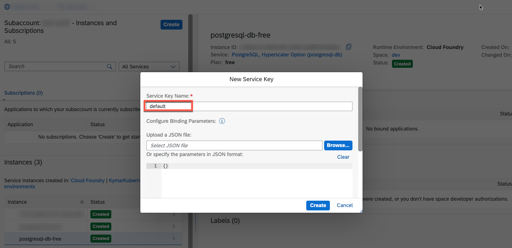
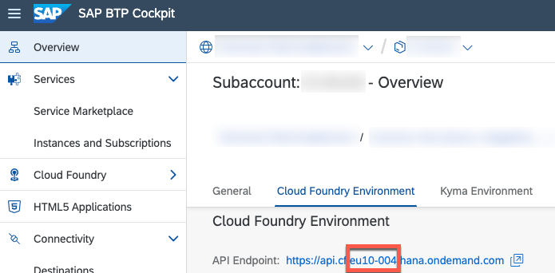
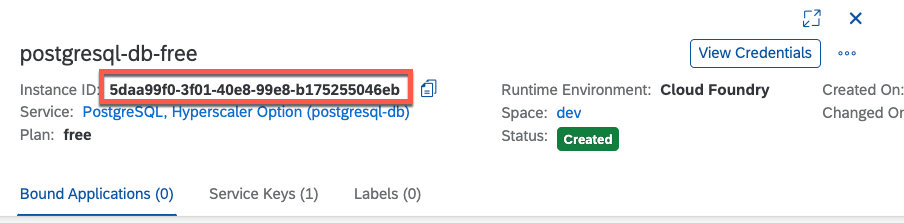
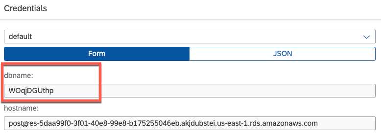
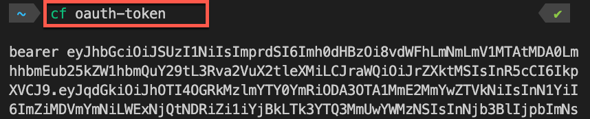
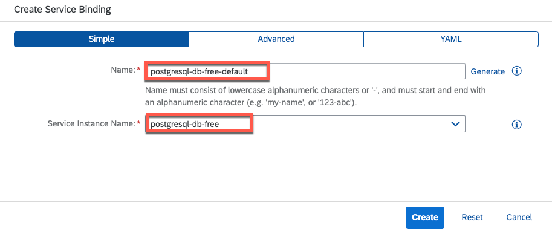
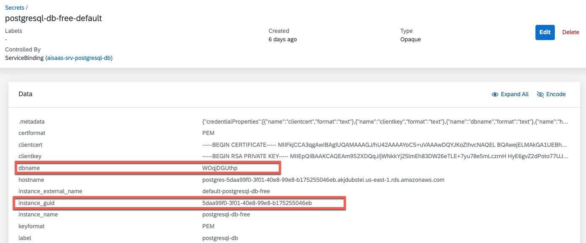
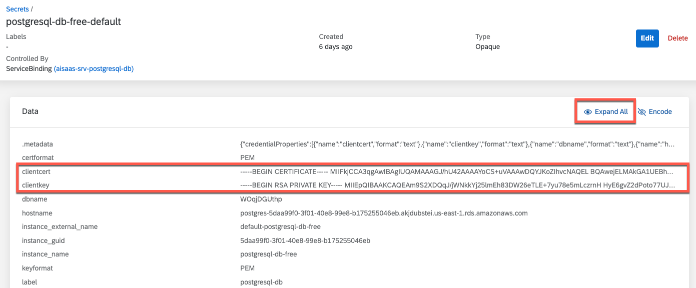
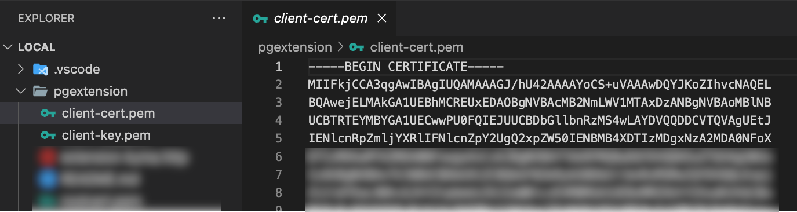

# Scenario Setup


## 1. Create new Subaccount

Create a new Subaccount in your SAP BTP Cockpit, which will act as SaaS Provider Subaccount. Please consider the following infos before creating a subaccount in a concrete region (as of September 2023).

**SAP BTP, Kyma Runtime**

- **PostgreSQL** access only available for **AWS** landscapes

**SAP HANA Cloud**

- **free** plan not available in eu10

**SAP BTP, Cloud Foundry Runtime**

- **free** plan not available in eu10

**SAP AI Core**

- Only available in **AWS** landscapes

**Important** - If aiming for a setup using **Free Tier** service plans, as of today, we suggest to setup the sample scenario in the AWS **us10** region. This has been successfully tested.


## 2. Assign Entitlements

Assign further entitlements to your Provider Subaccount. All required entitlements offer **free** service plans or plans that come with no additional costs (e.g., broker, hdi-shared, toos, central).

**Important** - This setup assumes, that you will create a new SAP HANA Cloud instance in the respective Provider Subaccount. In case you are sharing an existing SAP HANA Cloud instance, please skip the **SAP HANA Cloud** entitlements and only assign the **hdi-shared** service plan

**SAP BTP, Kyma Runtime**

| Service / Subscription                                                                                                                                               | Free Tier Plans      |
| -------------------------------------------------------------------------------------------------------------------------------------------------------------------- | -------------------- |
| [SAP AI Core](https://discovery-center.cloud.sap/serviceCatalog/sap-ai-core?region=all)                                                                              | free                 |
| [SAP Authorization and Trust Management Service](https://discovery-center.cloud.sap/serviceCatalog/authorization-and-trust-management-service?region=all)            | broker               |
| [SAP BTP, Kyma Runtime](https://discovery-center.cloud.sap/serviceCatalog/kyma-runtime?region=all)                                                                   | free                 |
| [SAP Cloud Management Service for SAP BTP](https://discovery-center.cloud.sap/serviceCatalog/cloud-management-service?region=all)                                    | central              |
| [SAP HANA Cloud](https://discovery-center.cloud.sap/serviceCatalog/sap-hana-cloud?region=all) <br> (Optional if shared instance is used)                             | hana-free <br> tools |
| [SAP HANA Schemas & HDI Containers](https://help.sap.com/docs/SAP_HANA_PLATFORM/3823b0f33420468ba5f1cf7f59bd6bd9/e28abca91a004683845805efc2bf967c.html?locale=en-US) | hdi-shared           |
| [PostgreSQL on SAP BTP, hyperscaler option](https://discovery-center.cloud.sap/serviceCatalog/postgresql-hyperscaler-option?region=all)                              | free                 |

**SAP BTP, Cloud Foundry Runtime**

| Service / Subscription                                                                                                                                               | Free Tier Plans      |
| -------------------------------------------------------------------------------------------------------------------------------------------------------------------- | -------------------- |
| [SAP AI Core](https://discovery-center.cloud.sap/serviceCatalog/sap-ai-core?region=all)                                                                              | free                 |
| [SAP Authorization and Trust Management Service](https://discovery-center.cloud.sap/serviceCatalog/authorization-and-trust-management-service?region=all)            | broker               |
| [SAP BTP, Cloud Foundry Runtime](https://discovery-center.cloud.sap/serviceCatalog/cloud-foundry-runtime?region=all)                                                 | free                 |
| [SAP Cloud Management Service for SAP BTP](https://discovery-center.cloud.sap/serviceCatalog/cloud-management-service?region=all)                                    | central              |
| [SAP Credential Store](https://discovery-center.cloud.sap/serviceCatalog/credential-store?region=all)                                                                | free                 |
| [SAP HANA Cloud](https://discovery-center.cloud.sap/serviceCatalog/sap-hana-cloud?region=all) <br> (Optional if shared instance is used)                             | hana-free <br> tools |
| [SAP HANA Schemas & HDI Containers](https://help.sap.com/docs/SAP_HANA_PLATFORM/3823b0f33420468ba5f1cf7f59bd6bd9/e28abca91a004683845805efc2bf967c.html?locale=en-US) | hdi-shared           |
| [PostgreSQL on SAP BTP, hyperscaler option](https://discovery-center.cloud.sap/serviceCatalog/postgresql-hyperscaler-option?region=all)                              | free                 |


## 3. Configure SAP HANA Cloud

Depending on your landscape setup, either create a new SAP HANA Cloud instance or share an existing SAP HANA Cloud instance with your Cloud Foundry Org/Space respectively your Kyma Cluster/Namespace. 

**Create a new Instance**

Create a Subscription of the SAP HANA Cloud Tools, assign the role collections to your user and create a new SAP HANA Cloud instance using the Subscription interface.Please ensure this SAP HANA Cloud Instance is shared with your Kyma Cluster/Namespace or Cloud Foundry Org/Space. 

**Share an existing Instance**

Switch to the SAP BTP Subaccount hosting your SAP HANA Cloud instance and use the SAP HANA Cloud Tools, to share the instance with your new Cloud Foundry Org/Space respectively your Kyma Cluster/Namespace. 


## 4. Setup AI Core (future release)

Currently, this step is not required, as a SAP AI Core instance hosted by SAP will be used.


## 5. Define AI Destination

You will receive credentials by SAP, which can be used in a destination of your SAP BTP Provider Subaccount and allow you to connect your application to the centrally hosted SAP AI Core instance. Please create a new Subaccount-level destination in your Provider Subaccount as follows.

```md
Name=PROVIDER_AI_CORE_DESTINATION
Type=HTTP
ProxyType=Internet
Authentication=OAuth2ClientCredentials
tokenServiceURLType=Dedicated
clientId=<uaa.clientid>
clientSecret=<uaa.clientsecret>
tokenServiceURL=<uaa.url>/oauth/token
URL=<url>
```

Take the respective placeholders from the Service Key provided by SAP. Do not be concerned if you receive a 401 error when testing the destination

## 6. Build and Deploy the Application 

### 6.1. Cloud Foundry

6.1.1. If not done yet, please (fork and) clone the repository to your development environment. 

```sh
git clone https://github.tools.sap/btp-use-case-factory/btp-cap-multitenant-ai
```

6.1.2. Please switch to the *deploy/cf* directory. 

```sh
cd deploy/cf
```

6.1.3. Run the following command to build the CAP components of your application. 

```sh
npm run build
```

6.1.4. Run the following command to generate unique Service Plan Ids for your Service Broker. 

>**Hint** - Using the **-private** file name extension, these Ids will not be committed to GitHub. 

```sh
cp ../../code/broker/catalog.json ../../code/broker/catalog-private.json
npx --yes -p @sap/sbf gen-catalog-ids ../../code/broker/catalog-private.json
```

6.1.5. Run the following password to create a new Service Broker password. Please copy the generated plaintext password and hashed credentials and store them in a secure place!

```sh
npx --yes -p @sap/sbf hash-broker-password -b
```

6.1.6. Please duplicate the **free-tier.mtaext** file in the **deploy/cf/mtaext** directory and add the **-private** suffix before the file name extension, so that you have a second file called **free-tier-private.mtaext**. Adding the **-private** suffix will ensure this file is not committed to GitHub. 

6.1.7. Open the **free-tier-private.mtaext** file and replace the placeholder "\<paste your hash credentials here\>" with your **hashed credentials** value created a few steps ago. Your file should look similar to the following. 

```yaml
ID: aisaas.freetier
_schema-version: 3.2.0
version: 1.0.0
extends: aisaas

modules:
  - name: aisaas-api-sb
    properties:
      SBF_BROKER_CREDENTIALS_HASH:  >
        {
          "broker-user": "sha256:0vsw3...bPwNwUc9WM=:5osh6/uiq...LcE9T0="
        }
```

6.1.8. Please run the following command to build your **mtar** file. 

```sh
npm run build:mbt
```

6.1.9. Once finished, please ensure you are logged in to your target Cloud Foundry Space by running the following command. Login if required. 

```sh
# Check target Space #
cf t

# Login if required #
cf login -a "https://api.cf.<Region>.hana.ondemand.com"
```

6.1.10. Start the deployment to Cloud Foundry, by running the following command. 

```sh
npm run deploy
```

This will take a while, as especially creating the **PostgreSQL on SAP BTP, hyperscaler option** service instance might take up to 30mins. Wait for the process to finish successfully and also check in the **SAP BTP Cockpit** if all service instances have been created successfully. 


### 6.2. Kyma

The build and deployment process in Kyma requires you to build container images for the components of this sample scenario before using a helm deployment approach. Please make sure you have the respective tools installed in your development environment such as **helm**, **Docker** and **kubectl**. 

6.2.1. If not done yet, please (fork and) clone the repository to your development environment. 

```sh
git clone https://github.tools.sap/btp-use-case-factory/btp-cap-multitenant-ai
```

6.2.2. Please switch to the *deploy/kyma* directory. 

```sh
cd deploy/kyma
```

6.1.3. Run the following command to build the CAP components of your application. 

```sh
npm run build
```

6.1.4. In your personal **values-private.yaml** file, please provide values for the following parameters, based on your own environment and the Container Registry being used. 

**global**

  * imagePullSecret - Name of a Image Pull Secret if required.
    > **Hint** - This value needs to contain the reference to a potential Image Pull Secret of your Container Registry. If you're using a free Docker Hub account and public Docker Images, this property can be left unchanged (empty object).

  * domain - Your Kyma Cluster default or custom domain.
    > **Hint** - To get the default domain of your Kyma Cluster you can run the following kubectl command: 
    >
    > ```kubectl get configMaps/shoot-info -n kube-system -o jsonpath='{.data.domain}'```
    > 
    > This will return the required result like *a1b2c3.kyma.ondemand.com*. *a1b2c3* is a placeholder for a string of characters that’s unique for your cluster (the so-called **shootName** which we need in the next step). 

  * shootName - The unique shoot name of your Kyma Cluster.
    > **Hint** - To get the **shootName** of your Kyma Cluster, run the following kubectl command:  
    > 
    >```kubectl get configMaps/shoot-info -n kube-system -o jsonpath='{.data.shootName}'```.<br> 
    > 
    > In a productive SAP BTP landscape, your **shootName** will always starts with a letter like *a1b2c3* or with the prefix **c-** like c-1b2c3d4*. 


**router**

  * image.repository - Registry details of your **Application Router** Container Image like \<username>/aisaas-router if your images are stored in Docker Hub or ghcr.io/\<namespace>/aisaas-router in case of GitHub.
  * image.tag - Provide the tag of your container image if you do not want to use the latest image.

**srv**

  * image.repository - Registry details of your **App Service** Container Image repository like \<username>/aisaas-srv.
  * image.tag - Provide the tag of your container image if you do not want to use the latest image.
    
**api**

  * image.repository - Registry details of your **API Service** Container Image repository like \<username>/aisaas-api
  * image.tag - Provide the tag of your container image if you do not want to use the latest image.

**broker**

  * image.repository - Registry details of your **API Service Broker** Container Image repository like \<username>/aisaas-broker.
  * image.tag - Provide the tag of your container image if you do not want to use the latest image.
  * config.serviceId & planId(s) - Generate and provide unique GUIDs for your service plans and the broker itself. 

      > **Important** - Run the following script which will generate new GUIDs in a new */code/broker/catalog-private.json* file.<br>
      > 
      > **Run in ./code/broker**
      > ```sh 
      > # Execute in ./code/broker #
      > cp catalog.json catalog-private.json
      > npx --yes -p @sap/sbf gen-catalog-ids catalog-private.json
      > cat catalog-private.json
      > ```

**hana_deployer**

  * image.repository - Registry details of your **HDI Container Deployer** Container Image repository like \<username>/aisaas-db-com.
  * image.tag - Provide the tag of your container image if you do not want to use the latest image.

**html5_apps_deployer**

  * image.repository - Registry details of your **HTML5 Apps Deployer** Container Image repository like \<username>/aisaas-html5-deployer.
  * image.tag - Provide the tag of your container image if you do not want to use the latest image. 

**xsuaa**

  * parameters.oauth2-configuration.redirect-urls - Please provide your default Cluster Domain including a wildcard subdomain prefix ("*."). Keep the **localhost** redirects for local testing purposes. 

    > **Hint** - If you are using a custom domain, also provide this domain in the redirect-urls. More details can be found in the respective **Expert Feature** ([click here](../../4-expert/-Kyma-/custom-domain-usage/README.md))

    > **Hint** - Use the following **kubectl** command to retrieve your default Cluster domain.
    > 
    > ```kubectl get configMaps/shoot-info -n kube-system -o jsonpath='{.data.domain}'```

    ```yaml
      xsuaa:
        parameters:
          oauth2-configuration:
            redirect-uris:
              - https://*.a1b2c3.kyma.ondemand.com/**
              - http://*.localhost:5000/**
              - http://localhost:5000/**
    ```

6.2.8. Please run the following command to build the SAPUI5 app components. 

```sh
# Run in ./deploy/kyma # 
npm run ui:apps
```

6.2.9. Please run the following command to build the Container Images. Please set your Container Image Prefix as depicted below. 

> **Hint** - If you use e.g. DockerHub as a Container Registry, please put in your **username** (e.g., johndoe) as Container Image Prefix placeholder. If you use the GitHub Container Registry, the prefix will look similar to **ghcr.io/\<namespace>** (e.g. ghcr.io/johndoe). All generated Docker Images will be automatically prefixed with this label!

> **Hint** - Using devices with ARM chips (e.g., Apple M1) the build process involving Cloud Native Buildpacks might take several minutes. Please do not immediately cancel the build if things appear to be stuck, but wait some time for the process to continue (especially while the SBOM is being generated)!

```sh
# Run in ./deploy/kyma # 
npx cross-env IMAGE_PREFIX=<ContainerImagePrefix> npm run build:all

# Example
npx cross-env IMAGE_PREFIX=sap-demo npm run build:all
```

6.2.10. Please run the following command to push the Container Images. Please set your Container Image Prefix as depicted below. 

```sh
# Run in ./deploy/kyma # 
npx cross-env IMAGE_PREFIX=<ContainerImagePrefix> npm run push:all

# Example
npx cross-env IMAGE_PREFIX=sap-demo npm run push:all
```

6.2.11. Once your images have been pushed to your Container Registry and you updated your values-private.yaml file, you can deploy the application to your Kyma Cluster by running the following command. 

```sh
# Run in ./deploy/kyma # 
helm install <ReleaseName> ./charts -f ./charts/values-private.yaml -n <Namespace>

# Example
helm install aisaas ./charts -f ./charts/values-private.yaml -n default
```

This will take a while, as especially creating the **PostgreSQL on SAP BTP, hyperscaler option** service instance might take up to 30mins. Wait for the process to finish successfully and also check in the **Kyma Dashboard** if all service instances have been created successfully. 


## 7. Enable pgvector extension

Once the application was successfully deployed, you need to enable the **pgvector** extension on your new **PostgreSQL on SAP BTP, hyperscaler option** service instance.

### 7.1. Cloud Foundry

7.1.1. Create a new **Service Key** for your **PostgreSQL on SAP BTP, hyperscaler option** service instance in your **SAP BTP Cockpit**.

[](./images/PGExt_CfServiceKey.png?raw=true)

7.1.2. Run the following CURL command or use a tool like Postman to activate the extension. 

```html
curl -X PUT 'https://api-backing-services.<CloudFoundryRegion>.data.services.cloud.sap/v1/postgresql-db/instances/<PostgreSQLServiceInstanceId>/extensions/vector' \
  --header 'Authorization: <BearerToken>' \
  --header 'Content-Type: application/json' \
  --data-raw '{"database": "<DatabaseName>"}'
```

If you are unsure about your Cloud Foundry Region you can find it in the SAP BTP Cockpit or within the Service Key details. 

>**Important** - Ensure to incorporate potential extension landscapes such as eu10-004 or us10-001 when indicating the Region. 

[](./images/PGExt_CfRegion.png?raw=true)

You can retrieve the PostgreSQL Service Instance ID from the SAP BTP Cockpit, within the Service Instance details section. The region 

[](./images/PGExt_Instance.png?raw=true)

The database value that needs to be included in the JSON body of your request can be directly copied from your Client Credentials section within your Service Key.

[](./images/PGExt_Dbname.png?raw=true)

To obtain the required Authorization value, execute **cf oauth-token** from your command line. Ensure you have the Cloud Foundry CLI installed and that you are authenticated to the Org and Space where your PostgreSQL service instance resides. Please note, your user account must hold Space Developer permissions at a minimum. 

[](./images/PGExt_CfToken.png?raw=true)


### 7.2. Kyma

7.2.1. Create a new **Service Binding** for your **PostgreSQL on SAP BTP, hyperscaler option** service instance in your **Kyma Dashboard**.

[](./images/PGExt_KymaBinding.png?raw=true)

7.1.2. Run the following CURL command or use a tool like Postman to activate the extension. 

```html
curl -X PUT 'https://api-backing-services-k8s.<KymaRegion>.data.services.cloud.sap/v1/postgresql-db/instances/<PostgreSQLServiceInstanceId>/extensions/vector' \
  --cert client-cert.pem \
  --key client-key.pem \
  --header 'Content-Type: application/json' \
  --data-raw '{"database": "<DatabaseName>"}'
```

The Region of your Kyma Cluster will always relate to the central region such as **eu10** or **us10** and there is no need to provide extension landscape suffixes such as **eu10-004**. This is only required for Cloud Foundry scenarios. 

In a similar vein, for Kyma, the PostgreSQL Service Instance ID and the database can be extracted directly from your Client Credentials within your Service Binding. 

[](./images/PGExt_KymaDetails.png?raw=true)

In Kyma, an authentication method relying on certificates comes into play. The Client Certificate and Client Key essential for this purpose can be derived from the Service Binding (or respectively the associated generated Secret) you’ve crafted within Kyma. 

[](./images/PGExt_KymaCertKey.png?raw=true)

Take the clientcert and clientkey values and create new files on your local device. It’s crucial to ensure that you accurately reference these files within your curl command. To access the content, make sure you expand the Service Binding details from your Kyma Dashboard before copying. 

[](./images/PGExt_KymaCert.png?raw=true)

With all the necessary components in place, it’s time to execute the curl command from this directory. This action will trigger the enabling of the pgvector extension.

## 8. Push sample emails


## 9. Test the Application
