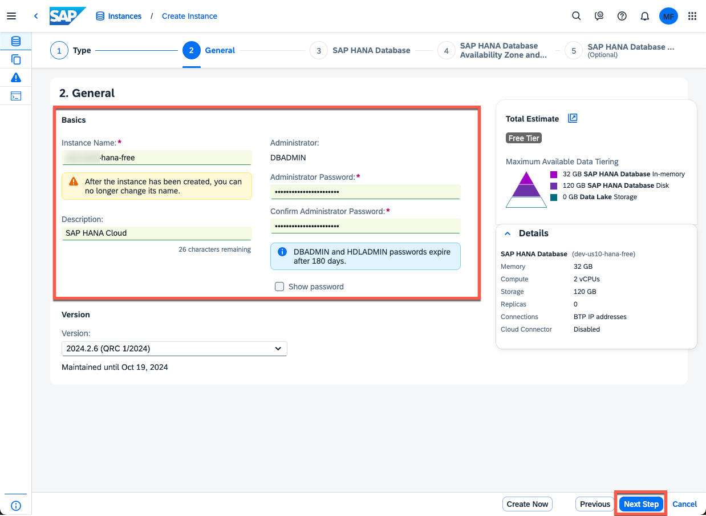
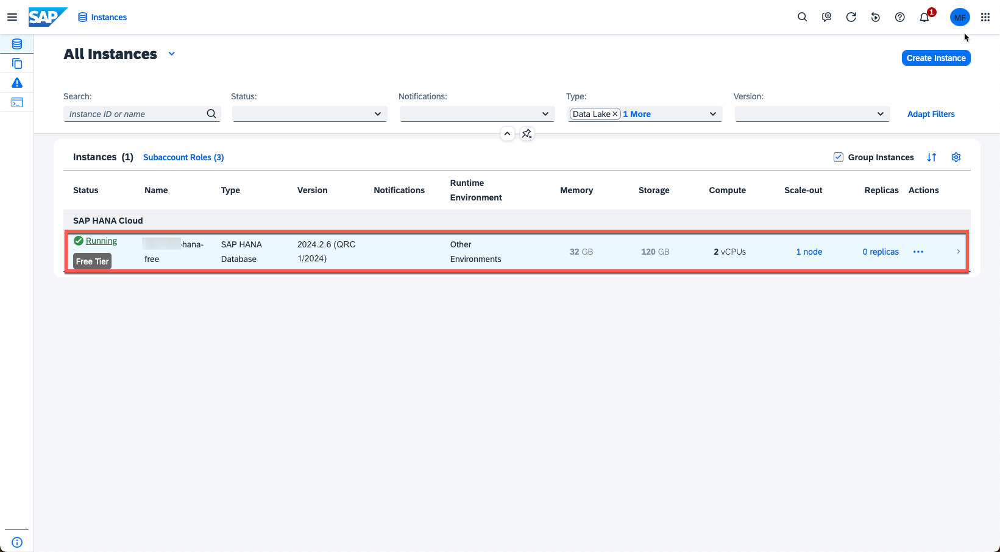

#  Configure SAP HANA Cloud

Depending on your landscape setup, either create a new SAP HANA Cloud instance or share an existing SAP HANA Cloud instance with your Cloud Foundry Org/Space respectively your Kyma Cluster/Namespace. 

- [Configure SAP HANA Cloud](#configure-sap-hana-cloud)
  - [Setup your preferred SAP BTP Runtime](#setup-your-preferred-sap-btp-runtime)
  - [Create a new SAP HANA Cloud Instance](#create-a-new-sap-hana-cloud-instance)
  - [Share/Map an existing SAP HANA Cloud Instance](#sharemap-an-existing-sap-hana-cloud-instance)

To do so, please follow the respective SAP HANA Academy tutorial and official SAP Help documentation linked below. 

[SAP BTP Developer Onboarding | SAP HANA Cloud](https://blogs.sap.com/2022/12/16/sap-btp-developer-onboarding-sap-hana-cloud/)

[SAP Help | Map an SAP HANA Database to another Environment Context](https://help.sap.com/docs/hana-cloud/sap-hana-cloud-administration-guide/map-sap-hana-database-to-another-environment-context)

## Setup your preferred SAP BTP Runtime

Before you setup a SAP HANA Cloud instance or map an existing instance, please ensure you have setup your preferred runtime. For this sample scenario, you can choose between the SAP BTP, Cloud Foundry or SAP BTP, Kyma Runtime. If you follow the Cloud Foundry path, please make sure to also create a **Space** after setting up the runtime. The Kyma Runtime comes with a **default** namespace. 

> **Important** - In a Free Tier scenario, please ensure to select the **free** service plan! 

## Create a new SAP HANA Cloud Instance 

Create a Subscription of the SAP HANA Cloud Tools, assign the role collections to your user and create a new SAP HANA Cloud instance using the Subscription interface. After creating the SAP HANA Cloud instance, please continue with the next step to share / map it to your SAP BTP, Cloud Foundry or SAP BTP, Kyma Runtime. 

## Share/Map an existing SAP HANA Cloud Instance

Switch to the SAP BTP Subaccount hosting your SAP HANA Cloud instance and use the SAP HANA Cloud Tools, to share the instance with your new Cloud Foundry Org/Space respectively your Kyma Cluster/Namespace. Click [here](https://help.sap.com/docs/hana-cloud/sap-hana-cloud-administration-guide/map-sap-hana-database-to-another-environment-context) for more details on how to setup the respective mapping. 

