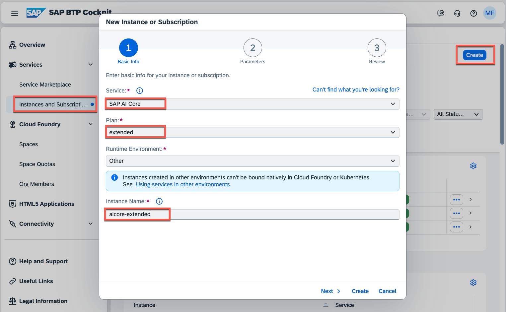
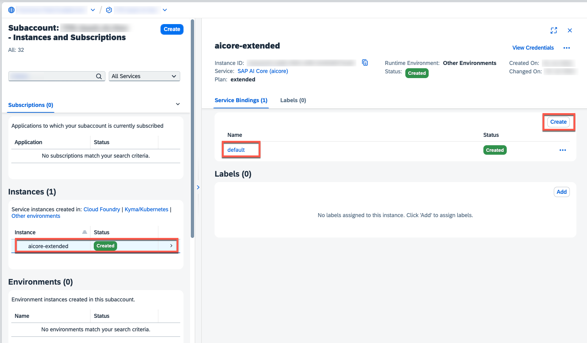
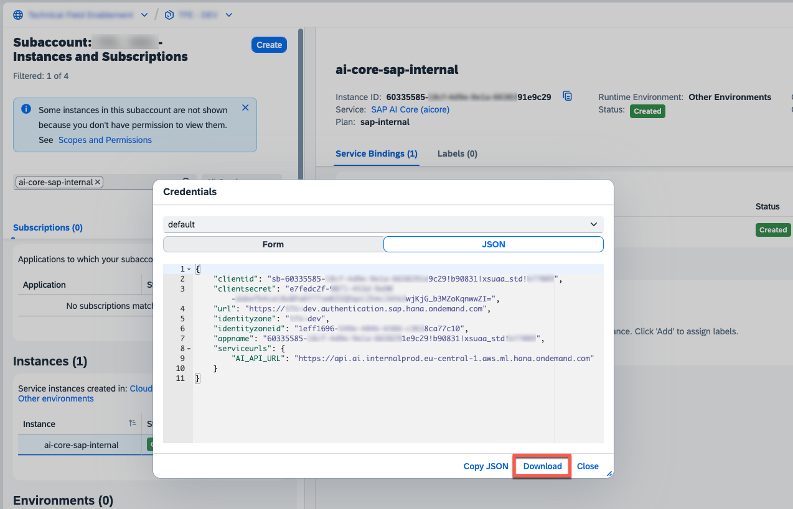

# Setup the generative AI hub in SAP AI Core

The generative AI hub which is part of the SAP AI Core offering, allows you to connect your application to various Large Language Models such as the GPT series via Azure OpenAI or SAP-hosted models like Mistrals', as well as respective embedding models. In this chapter you will learn how to setup the respective SAP AI Core component in your SAP BTP Global Account:

1. As described in on the previous chapters, please ensure you assigned the following entitlement to your subaccount.

- **SAP AI Core** - extended

  

2. In your subaccount, please create a new service instance for the SAP AI Core **extended** service entitlement.

   > **Hint** - In our scenario we are using the **Other** environment type, as we are consuming the SAP AI Core APIs via a dedicated destination. Alternatively, you can also use the **Cloud Foundry** or **Kyma** environment and **bind** the service instance.

   

3. Create a new **Service Binding** for the SAP AI Core **extended** service instance, which will be used by our sample application.

   

4. Download the generated Service Binding details or copy the values for your reference.

   
