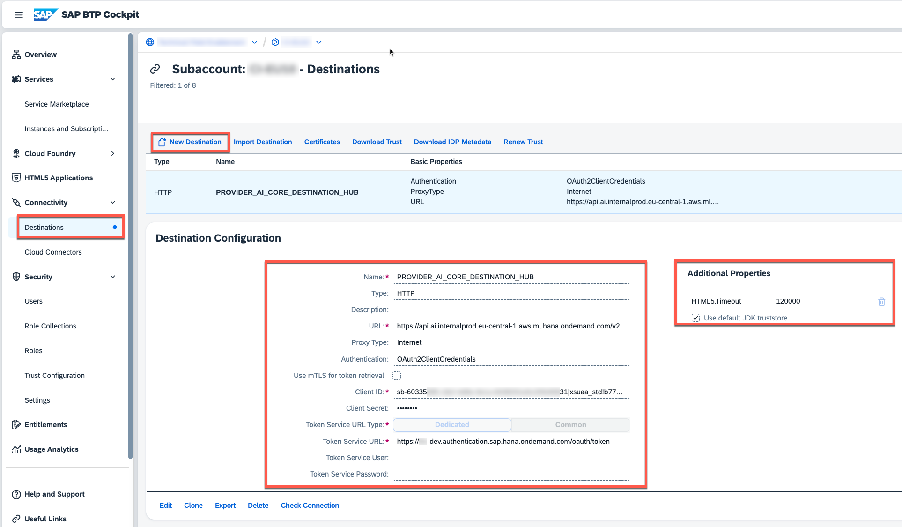

#  Setup the generative AI hub in SAP AI Core

The generative AI hub which is part of the SAP AI Core offering, allows you to connect your application to various Large Language Models such as GTP 3.5 and GTP 4, as well as respective embedding models. In this chapter you will learn how to setup the respective SAP AI Core component in your SAP BTP Global Account. In the multi-tenant scenario, the respective objects such as *Configurations* and *Deployments* will be generated automatically once a new tenant is being onboarded. This feature is planned to be delivered for the Single-Tenant scenario too. 


## Create Service Instance 

1. As described in on the previous chapters, please ensure you assigned the following entitlements to your subaccount.

  - **SAP AI Launchpad** - free (Application)
  - **SAP AI Core** - sap-internal 

2. In your subaccount, please create a new service instance for the SAP AI Core **sap-internal** service entitlement. 

>**Hint** - In our scenario we are using the **Other** environment type, as we are consuming the SAP AI Core APIs via a dedicated destination. Alternatively, you can also use the **Cloud Foundry** or **Kyma** environment and **bind** the service instance. 

  [](./images/GAH_CreateInstance01.png?raw=true)

3. Create a new **Service Binding** for the SAP AI Core **sap-internal** service instance, which will be used by our sample application. 

  [](./images/GAH_CreateInstance02.png?raw=true)

4. Download the generated Service Binding details or copy the values for your reference.

  [](./images/GAH_CreateInstance03.png?raw=true)


## Create Destination

Create a new destination in your Provider Subaccount using the Service Binding details of your SAP AI Core **sap-internal** service instance. This destination will be used by the multitenant SaaS application. 
   
> **Important** - Please make sure to add the HTML5.Timeout property!

[](./images/GAH_Destination.png?raw=true)

```html
Name=PROVIDER_AI_CORE_DESTINATION_HUB
Type=HTTP
clientId=<clientid>
clientSecret=<cliensecret>
Authentication=OAuth2ClientCredentials
tokenServiceURL=<url>/oauth/token
ProxyType=Internet
URL=<serviceurls.AI_API_URL>/v2
tokenServiceURLType=Dedicated
HTML5.Timeout=120000
```

## Configure the generative AI hub (single-tenant)

> **Important** - Will be provided soon!