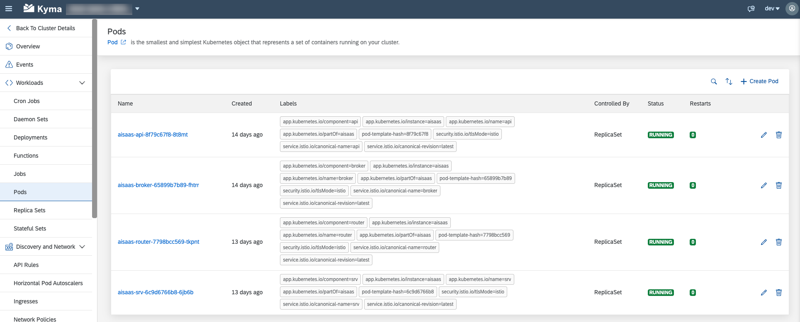
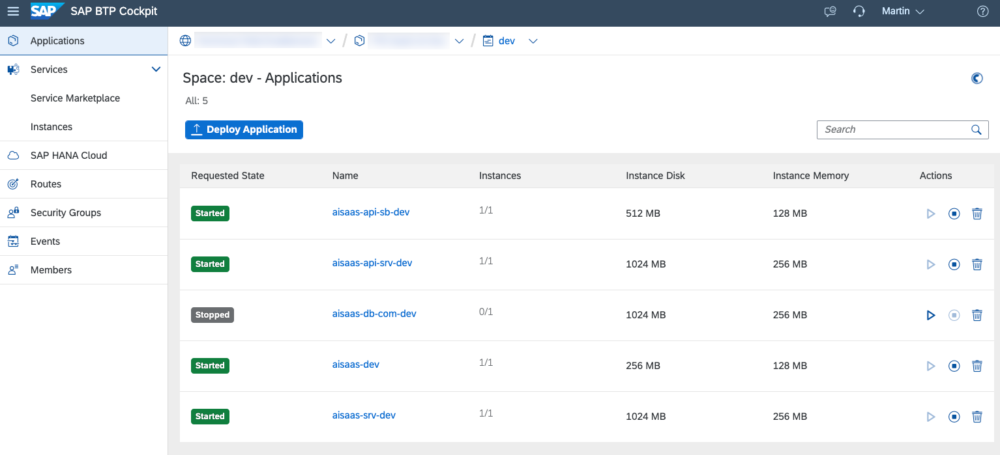

#  Deploy the Application 

Depending on your target runtime, different deployment steps are required. Please follow the corresponding instructions for your chosen runtime.

  - [SAP BTP, Kyma Runtime](#sap-btp-kyma-runtime) <br>
  - [SAP BTP, Cloud Foundry Runtime](#sap-btp-cloud-foundry-runtime)

##  SAP BTP, Kyma Runtime

The deployment process in Kyma requires you to use a helm-based deployment approach. Please ensure you have the respective command line tools installed in your development environment such as **helm**, **Docker** and **kubectl** before you proceed!

> **Hint** - In this tutorial we assume a basic understanding of the Kyma deployment process. If you are not familiar with deployment of Kyma solutions, please refer to our [Multitenant SaaS Sample Scenario](https://github.com/SAP-samples/btp-cap-multitenant-saas/#readme) or follow the respective [SAP Developer Journey](https://learning.sap.com/learning-journey/deliver-side-by-side-extensibility-based-on-sap-btp-kyma-runtime) to learn the basics and get your setup ready.

1. Before you start the deployment, please copy and rename to provided **values-private.sample.yaml** file to **values-private.yaml**. This will ensure that your configuration details are not being committed to GitHub by accident.  


2. Pease provide values for the following parameters in your **values-private.yaml** file, based on your own environment and the Container Registry being used. 

    <details>
      <summary>global</summary>

      * imagePullSecret - Name of a Image Pull Secret if required.
        > **Hint** - This value needs to contain the reference to a potential Image Pull Secret of your Container Registry. If you're using a free Docker Hub account and public Docker Images, this property can be left unchanged (empty object). Otherwise, the configuration could look similar to the following. 
        > ```yaml
        > imagePullSecret:
        >   - name : image-pull-secret
        > ```
        > You can create the Secret before deploying your application or as part of the Helm deployment process.

      * domain - Your Kyma Cluster default or custom domain.
        > **Hint** - To get the default domain of your Kyma Cluster you can run the following kubectl command: 
        >
        > ```kubectl get configMaps/shoot-info -n kube-system -o jsonpath='{.data.domain}'```
        > 
        > This will return the required result like *a1b2c3.kyma.ondemand.com*. *a1b2c3* is a placeholder for a string of characters that’s unique for your cluster (the so-called **shootName** which we need in the next step). 

      * shootName - The unique shoot name of your Kyma Cluster.
        > **Hint** - To get the **shootName** of your Kyma Cluster, run the following kubectl command:  
        > 
        >```kubectl get configMaps/shoot-info -n kube-system -o jsonpath='{.data.shootName}'```.<br> 
        > 
        > In a productive SAP BTP landscape, your **shootName** will always starts with a letter like *a1b2c3* or with the prefix **c-** like c-1b2c3d4*. 
    </details>

    <details>
    <summary>router</summary>

      * image.repository - Registry details of your **Application Router** Container Image like \<username>/ai(saas)-router if your images are stored in Docker Hub or ghcr.io/\<namespace>/aisaas-router in case of GitHub.
      * image.tag - Provide the tag of your container image if you do not want to use the latest image.
    </details>

    <details>
    <summary>srv</summary>

      * image.repository - Registry details of your **App Service** Container Image repository like \<username>/ai(saas)-srv.
      * image.tag - Provide the tag of your container image if you do not want to use the latest image.
    </details>

    <details>
    <summary>api (Multitenant only)</summary>

      * image.repository - Registry details of your **API Service** Container Image repository like \<username>/aisaas-api
      * image.tag - Provide the tag of your container image if you do not want to use the latest image.
    </details>

    <details>
    <summary>broker (Multitenant only)</summary>

      * image.repository - Registry details of your **API Service Broker** Container Image repository like \<username>/aisaas-broker.
      * image.tag - Provide the tag of your container image if you do not want to use the latest image.
      * config.serviceId & planId(s) - Generate and provide unique GUIDs for your service plans and the broker itself. 

          > **Important** - Run the following script which will generate new GUIDs in a new */code/broker/catalog-private.json* file.<br>
          > 
          > **Run in ./multi-tenant/code/broker**
          > ```sh 
          > # Execute in ./multi-tenant/code/broker #
          > cp catalog.json catalog-private.json
          > npx --yes -p @sap/sbf gen-catalog-ids catalog-private.json
          > cat catalog-private.json
          > ```
    </details>

    <details>
    <summary>hana_deployer</summary>

      * image.repository - Registry details of your **HDI Container Deployer** Container Image repository like \<username>/ai(saas)-db(-com).
      * image.tag - Provide the tag of your container image if you do not want to use the latest image.
    </details>

    <details>
    <summary>html5_apps_deployer</summary>

      * image.repository - Registry details of your **HTML5 Apps Deployer** Container Image repository like \<username>/aisaas-html5-deployer.
      * image.tag - Provide the tag of your container image if you do not want to use the latest image. 
    </details>

    <details>
    <summary>xsuaa</summary>

      * parameters.oauth2-configuration.redirect-urls - Please provide your default Cluster Domain including a wildcard subdomain prefix ("*."). Keep the **localhost** redirects for local testing purposes. 

        > **Hint** - If you are using a custom domain, also provide this domain in the redirect-urls. More details can be found in the respective **Expert Feature** ([click here](../../4-expert/-Kyma-/custom-domain-usage/README.md))

        > **Hint** - Use the following **kubectl** command to retrieve your default Cluster domain.
        > 
        > ```kubectl get configMaps/shoot-info -n kube-system -o jsonpath='{.data.domain}'```

        ```yaml
          xsuaa:
            parameters:
              oauth2-configuration:
                redirect-uris:
                  - https://*.a1b2c3.kyma.ondemand.com/**
                  - http://*.localhost:5000/**
                  - http://localhost:5000/**
        ```
    </details>
    <br>

3.  Please double-check that your Container Images have been successfully pushed to your Container Registry and deploy the application to your Kyma Cluster by running the following command. 

    ```sh
    # Run in ./(multi/single)-tenant/deploy/kyma # 
    helm install <ReleaseName> ./charts -f ./charts/values-private.yaml -n <Namespace>

    # Example
    helm install aisaas ./charts -f ./charts/values-private.yaml -n default
    ```

4. This will take a while, as especially creating the **PostgreSQL on SAP BTP, hyperscaler option** service instance might take up to 30mins. Wait for the process to finish successfully and also check in the **Kyma Dashboard** if all service instances have been created successfully. 
   
    > **Important** - Ensure to update your **values-private.yaml** file in case you want to use an existing PostgreSQL instance as depicted below! The respective service instance must exist in the Kyma target namespace. 
    > ```yaml
    > # Bind existing instance
    > srv:
    >   bindings:
    >      postgresql-db:
    >        serviceInstanceName: 
    >        serviceInstanceFullname: existing-pgsql-instance-name
    >
    > # Disable instance creation
    > postgresql_db:
    >   enabled: false
    > ```
    > A similar setup can be achieved with an existing Credential Store instance if required.

    [](./images/DEP_KymaSuccess.png?raw=true)

5. This is it, you successfully deployed the sample application to your Kyma environment. Continue enabling the **pgvector** extension if not done yet. 
   
  

## SAP BTP, Cloud Foundry Runtime

As the application components are part of the deployment archive in the Cloud Foundry scenario, the process is fairly simple compared to the Kyma deployment, requiring you to specify your Container Image details used by Helm

1. Once your Multi-Target Application Archive is built, please ensure you are logged in to your target Cloud Foundry Space by running the following command. (Re-)Login if required. 

    ```sh
    # Check target Org and Space #
    cf t

    # (Re-)Login if required #
    cf login -a "https://api.cf.<Region>.hana.ondemand.com"
    ```

2. Start the deployment to Cloud Foundry, by running the following command. 

    > **Important** - Ensure to update your **free-tier-private.mtaext** file in case you want to use an **existing PostgreSQL instance** as depicted below! 
    > ```yaml
    > resources:
    >    - name: ai-postgresql-db
    >      # Reuse existing instance
    >      type: org.cloudfoundry.existing-service
    >      parameters:
    >        service-name: ${space}-aisaas-postgresql-db
    >        service-plan: free
    >        config:
    >          engine_version: "13"
    > ```
    > A similar setup can also be achieved with an existing Credential Store Service instance. 

    ```sh
    # Run in ./(multi/single)-tenant/deploy/cf # 
    npm run deploy
    ```

3. The deployment process will take a while, as especially creating the **PostgreSQL on SAP BTP, hyperscaler option** service instance might take up to 30mins. Wait for the process to finish successfully and also check in the **SAP BTP Cockpit** if all service instances have been created successfully. 
   
   > **Important** - Ensure to update your **mtaext** file in case you want to use an existing PostgreSQL instance! 
   
   [](./images/DEP_CfSuccess.png?raw=true)


4. This is it, you successfully deployed the sample application to your Cloud Foundry environment. Continue enabling the **pgvector** extension if not done yet. 


