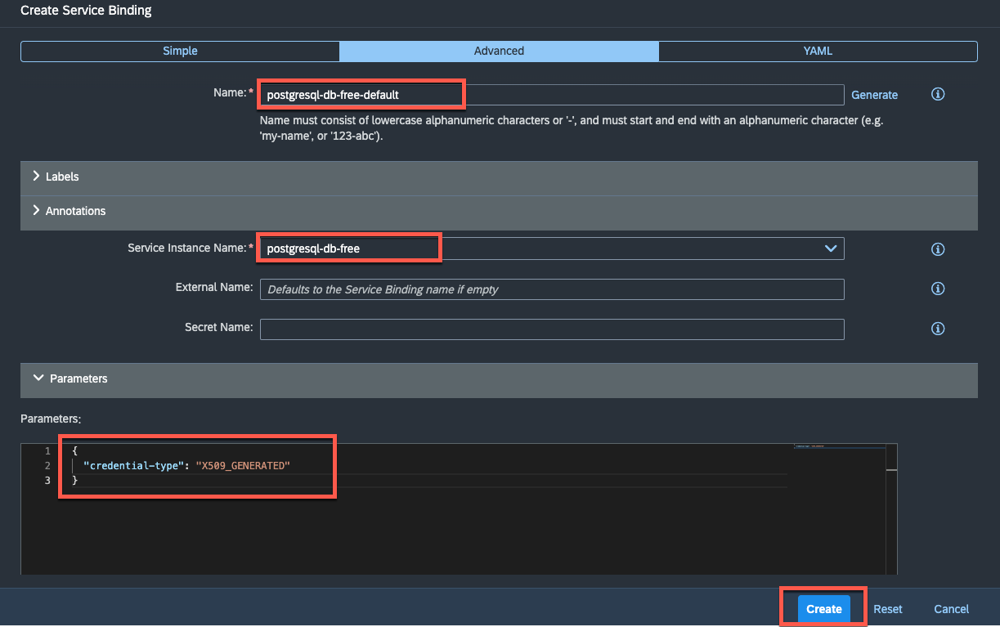
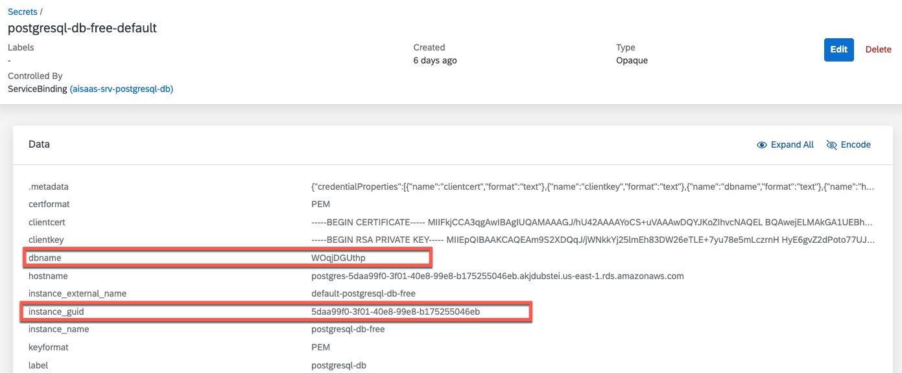
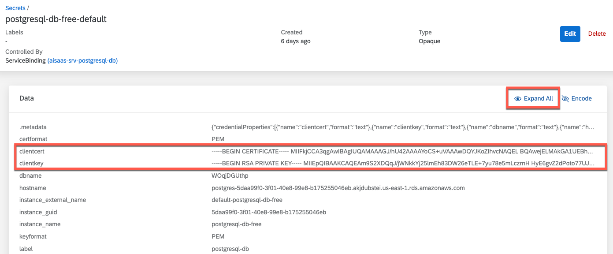
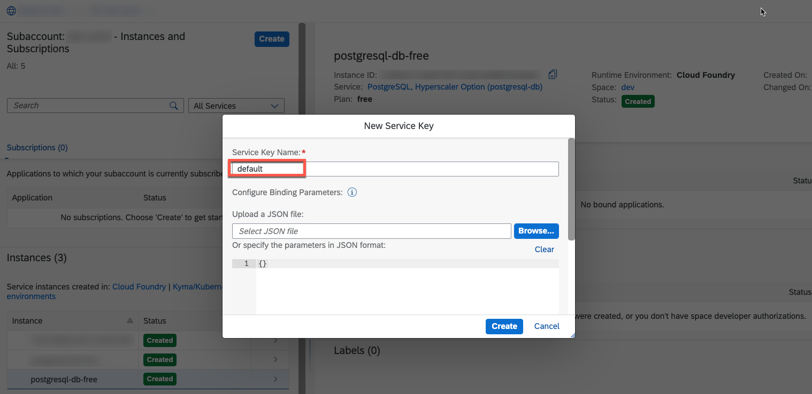
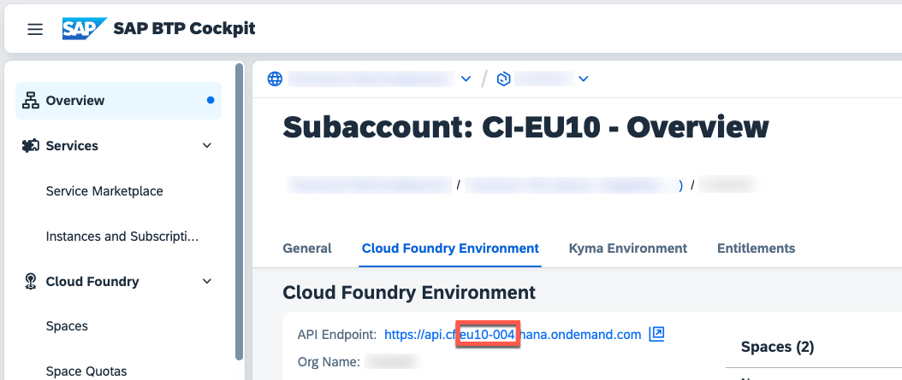
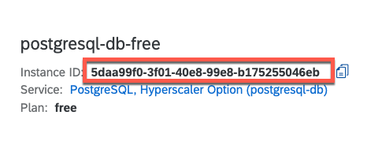
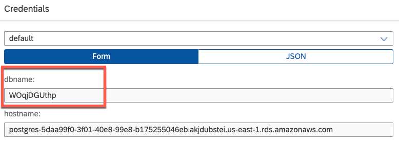
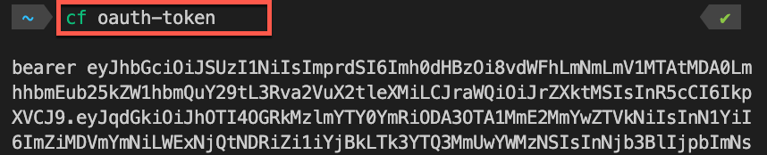

# Enable pgvector extension

Once the application was successfully deployed, you need to enable the **pgvector** extension on your new **PostgreSQL on SAP BTP, hyperscaler option** service instance. Please follow the tutorial steps of your selected runtime. 

- [Enable pgvector extension](#enable-pgvector-extension)
  - [SAP BTP, Kyma Runtime](#sap-btp-kyma-runtime)
  - [SAP BTP, Cloud Foundry Runtime](#sap-btp-cloud-foundry-runtime)


## SAP BTP, Kyma Runtime

Further details can be found in the official SAP Help documentation. The **PostgreSQL on SAP BTP, hyperscaler option** as well as the Extension API endpoints are available for Kyma instances in **AWS-regions** only (as of September 2023).

[SAP Help | Using the ‘PostgreSQL, Hyperscaler Option’ Extension APIs for Kyma](https://help.sap.com/docs/postgresql-hyperscaler-option/postgresql-on-sap-btp-hyperscaler-option/using-postgresql-hyperscaler-option-extension-apis-for-kyma?locale=en-US)

1. Create a new **X.509-based Service Binding** for your **PostgreSQL on SAP BTP, hyperscaler option** service instance in your **Kyma Dashboard**.
   
   > **Important** - Make sure to use the **Advanced** options to add the **credential-type** property as visible in the following screenshot!
   
    > **Hint** - Please keep in mind that your PostgreSQL service instance will be named differently based on your helm installation details e.g., **aisaas-postgresql-db**. 

    [](./images/PGExt_KymaBinding.png?raw=true)

2. Run the following CURL command or use a tool like Postman to activate the extension. 

    ```md
    curl -X PUT 'https://api-backing-services-k8s.<KymaRegion>.data.services.cloud.sap/v1/postgresql-db/instances/<PostgreSQLServiceInstanceId>/extensions/vector' \
      --cert client-cert.pem \
      --key client-key.pem \
      --header 'Content-Type: application/json' \
      --data-raw '{"database": "<DatabaseName>"}'
    
    # Example #
    curl -X PUT 'https://api-backing-services-k8s.eu10.data.services.cloud.sap/v1/postgresql-db/instances/5daa9...045eb/extensions/vector' \
      --cert client-cert.pem \
      --key client-key.pem \
      --header 'Content-Type: application/json' \
      --data-raw '{"database": "WOqjDGUthp"}'
    ```

    The SAP BTP region of your Kyma Cluster such as **eu10** or **us10**. Do not provide extension landscape suffixes such as **eu10-004**. This is only required for Cloud Foundry scenarios. 

    In a similar vein, for Kyma, the PostgreSQL Service Instance ID and the database can be extracted from the Client Credentials within your Service Binding (check in Kyma Dashboard or using kubectl).

    [](./images/PGExt_KymaDetails.png?raw=true)

    In Kyma, an authentication method relying on certificates comes into play. The Client Certificate and Client Key essential for this purpose can be derived from the Service Binding (or respectively the associated generated Secret) you’ve crafted within Kyma. 

    [](./images/PGExt_KymaCertKey.png?raw=true)

    Take the clientcert and clientkey values and create new files (**client-cert.pem** and **client-key.pem**) on your local device. It’s crucial to ensure that you accurately reference these files within your curl command. To access the content, make sure you **expand** the Service Binding details from your Kyma Dashboard before copying. 

    [](./images/PGExt_KymaCert.png?raw=true)

    With all the necessary components in place, it’s time to execute the curl command from this directory. This action will trigger the enabling of the pgvector extension.

3. You should see the following response once the extension is successfully activated. 

    ```md
      {"status":"succeeded"}
    ```

4. To remove the extension from your PostgreSQL database, please use the same CURL command with the DELETE method instead of PUT. 

    ```md
    # Sample for Kyma #
    curl -X DELETE 'https://api-backing-services-k8s.<KymaRegion>.data.services.cloud.sap/v1/postgresql-db/instances/<PostgreSQLServiceInstanceId>/extensions/vector' \
      --cert client-cert.pem \
      --key client-key.pem \
      --header 'Content-Type: application/json' \
      --data-raw '{"database": "<DatabaseName>"}'
    ```

## SAP BTP, Cloud Foundry Runtime

Further details can be found in the official SAP Help documentation.

[SAP Help | Using the ‘PostgreSQL, hyperscaler option’ Extension APIs](https://help.sap.com/docs/postgresql-hyperscaler-option/postgresql-on-sap-btp-hyperscaler-option/using-postgresql-hyperscaler-option-extension-apis?locale=en-US)

1. Create a new **Service Key** for your **PostgreSQL on SAP BTP, hyperscaler option** service instance in your **SAP BTP Cockpit**.

    [](./images/PGExt_CfServiceKey.png?raw=true)

2. Run the following CURL command or use a tool like Postman to activate the extension. 

    ```md
    curl -X PUT 'https://api-backing-services.<CloudFoundryRegion>.data.services.cloud.sap/v1/postgresql-db/instances/<PostgreSQLServiceInstanceId>/extensions/vector' \
      --header 'Authorization: <BearerToken>' \
      --header 'Content-Type: application/json' \
      --data-raw '{"database": "<DatabaseName>"}'

    # Example #
    curl -X PUT 'https://api-backing-services.eu10-004.data.services.cloud.sap/v1/postgresql-db/instances/5daa99...5046eb/extensions/vector' \
      --header 'Authorization: bearer eyJhbG...' \
      --header 'Content-Type: application/json' \
      --data-raw '{"database": "WOqjDGUthp"}'
    ```

    If you are unsure about your Cloud Foundry Region you can find it in the SAP BTP Cockpit or within the Service Key details. 

    >**Important** - Ensure to incorporate potential extension landscapes such as eu10-004 or us10-001 when indicating the Region. 

    [](./images/PGExt_CfRegion.png?raw=true)

    You can retrieve the PostgreSQL Service Instance ID from the SAP BTP Cockpit, within the Service Instance details section. 

    [](./images/PGExt_Instance.png?raw=true)

    The database value that needs to be included in the JSON body of your request can be copied from your Client Credentials section within your Service Key.

    [](./images/PGExt_Dbname.png?raw=true)

    To obtain the required Authorization value, execute **cf oauth-token** from your command line. Ensure you have the Cloud Foundry CLI installed and that you are authenticated to the Org and Space where your PostgreSQL service instance resides. 
    
    > **Hint** - Please note your user account must hold at least Space Developer permissions. 

    [](./images/PGExt_CfToken.png?raw=true)

3. You should see the following response once the extension is successfully activated. 

    ```md
    {"status":"succeeded"}
    ```

4. To remove the extension from your PostgreSQL database, please use the same CURL command with the DELETE method instead of PUT. 

    ```md
    # Sample for Cloud Foundry #
    curl -X DELETE 'https://api-backing-services.<CloudFoundryRegion>.data.services.cloud.sap/v1/postgresql-db/instances/<PostgreSQLServiceInstanceId>/extensions/vector' \
      --header 'Authorization: <BearerToken>' \
      --header 'Content-Type: application/json' \
      --data-raw '{"database": "<DatabaseName>"}'
    ```