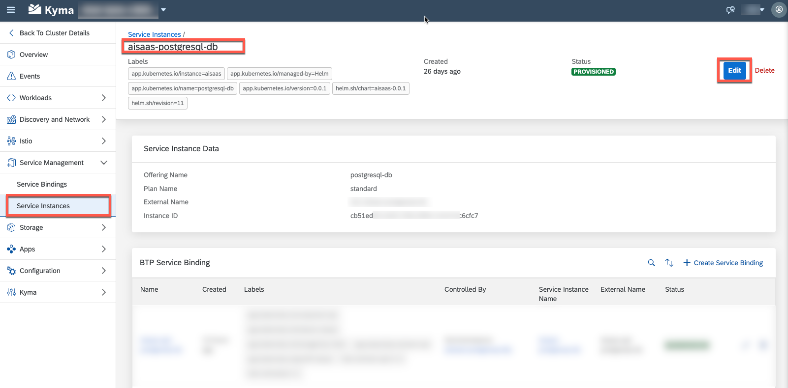
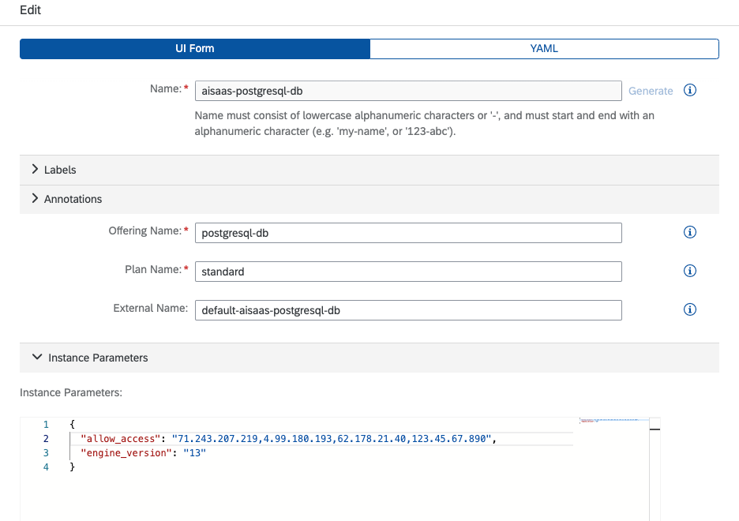
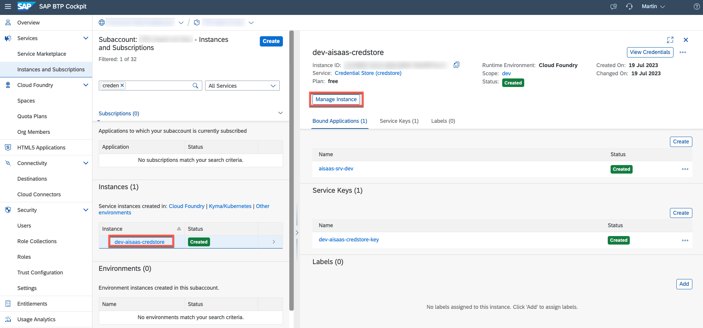
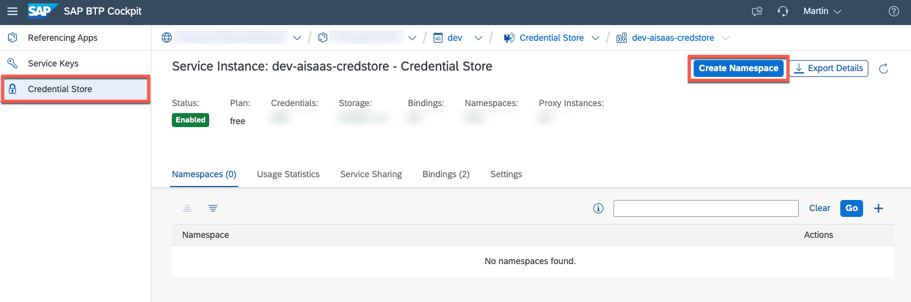
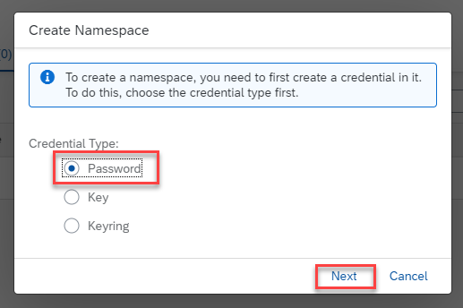
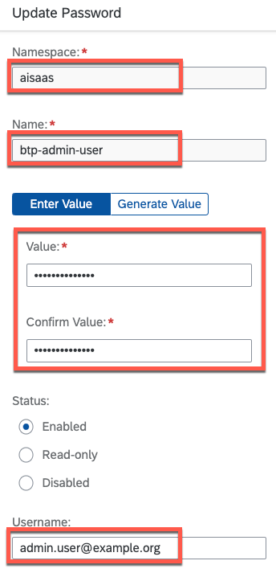
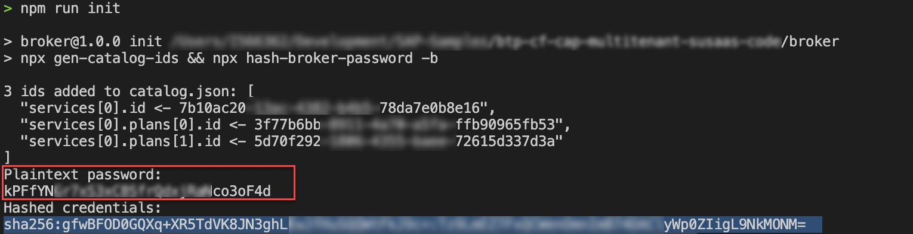
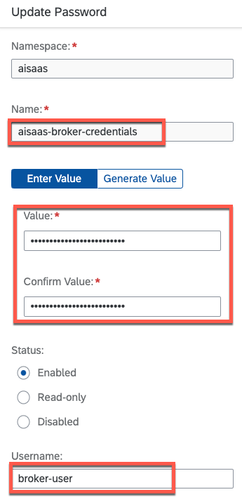

# Post-Deployment Actions

Depending on your favorite runtime, you need to apply two Post-Deployment Actions. In a **single-tenant** setup, Post-Deployment actions are required in the **SAP BTP, Kyma Runtime** only. 

- [Post-Deployment Actions](#post-deployment-actions)
  - [SAP BTP, Kyma Runtime (Single- and Multitenant)](#sap-btp-kyma-runtime-single--and-multitenant)
  - [SAP BTP, Cloud Foundry Runtime (Multitenant only)](#sap-btp-cloud-foundry-runtime-multitenant-only)


## SAP BTP, Kyma Runtime (Single- and Multitenant)

In the SAP BTP, Kyma Runtime you must ensure that your PostgreSQL database is reachable by your workloads, by providing your PostgreSQL Service Instance with the Egress Cluster IP addresses of your Kyma Cluster. Please follow the steps below to fulfill this requirement. 

1. Please download or copy the **Shell** or **PowerShell** scripts provided in the following SAP-Samples repository. 

    [SAP-Samples | Kyma Runtime Extension Samples](https://github.com/SAP-samples/kyma-runtime-extension-samples/tree/main/get-egress-ips)

2. By running these scripts in your development environment, you will get the egress IP addresses of your Kyma Cluster.
   
    > **Important** - The values below are just sample values! Make sure you run the script and determine your Cluster IP addresses!

    ```
    sh ./get-egress-ips.sh

    71.243.207.219
    4.99.180.193
    62.178.21.40
    ```

3. Please go to your **Kyma Dashboard** using the SAP BTP Cockpit, select your PostgreSQL Service Instance and click on **Edit**. 

    [](./images/PDEP_KymaIPgSql.png?raw=true)

4. In the **Instance Parameters** section, please add a new parameter called **allow_access**. Add the Egress IPs of your Kyma Cluster as comma-separated string. 

    > **Hint** - If you are planning to setup a hybrid testing setup, please also add your own IP address to the list of IP addresses. Keep in mind your private IP address is likely to change on a daily basis, so make sure to update that value from time to time. You can get your latest current IP address by using a website like [http://ifconfig.me/ip](http://ifconfig.me/ip).

    [](./images/PDEP_KymaIPs.png?raw=true)

5. Once you updated the settings, please click on **Update**. After a few minutes your PostgreSQL database should be reachable by your applications hosted in your Kyma Cluster.


## SAP BTP, Cloud Foundry Runtime (Multitenant only)

In Cloud Foundry, the SaaS sample application requires the usage of a Credential Store instance to securely store a SAP BTP Subaccount Admin user as well as the API Service Broker credentials. 

> **Important** - This is only required for the multitenant setup of the sample application.

1. In your Provider Subaccount, please go to the **Instances and Subscriptions** menu and click on your **\<Space>-aisaas-credstore** instance or use the **Manage Instance** button. 

    [](./images/CS_Service.png?raw=true)

2. In the instance management, please switch to the **Credential Store** menu and click on **Create Namespace**. 

    [](./images/CS_Namespace.png?raw=true)

3. A namespace needs to be created together with the first credential value. Therefore, please select the Credential Type **Password** and click on **Next**.   

    [](./images/CS_InitialValue.png?raw=true)

4. In the following screen, define the namespace called **aisaas** and provide the following credential value details.  

    **Name**: btp-admin-user

    **Value & Username**: Provide the e-mail address (Username) and password (Value) of a SAP BTP user which is used for automation purposes. Make sure this user has the **Subaccount Administrator** role-collection in your **Provider subaccount** and the **Space Developer** role in the respective Cloud Foundry Space.

    > **Hint** - If you don't want to use a personal/named user for this purpose, we recommend using a custom IdP and defining a technical user there. The usage of **P or S-User** for technical tasks is possible but for productive scenarios not recommended. 

    [](./images/CS_AdminUser.png?raw=true)

5. Please create a second **Password** credential value as described below.
 
    **Name**: aisaas-broker-credentials

    **Value & Username**: As Value please provide the **Plaintext Password** of your API broker user. This password is required when registering the API broker in any of your consumer subaccounts during automation.

    > **Hint** - You created this password in step 5 of [Build the components](./1-BuildTheComponents.md#cloud-foundry) . <br>
    [](./images/SB_PlainText.png?raw=true)

    As a Username please use the value **broker-user**. 

    [](./images/CS_BrokerUser.png?raw=true)

6. This is it, you successfully configured the Credential Store values as part of the **Post-Deployment Actions**. You can now continue testing the Application. 

