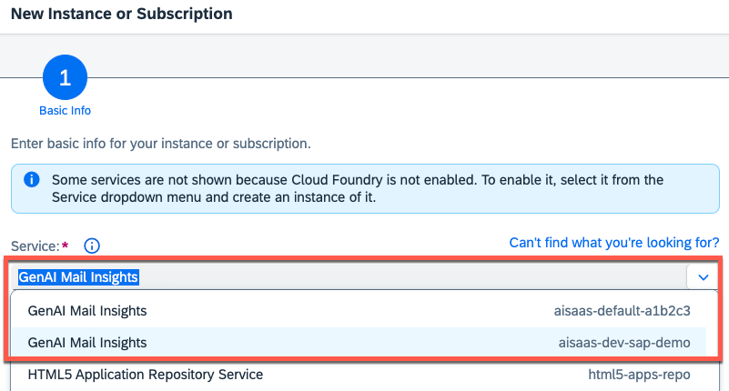
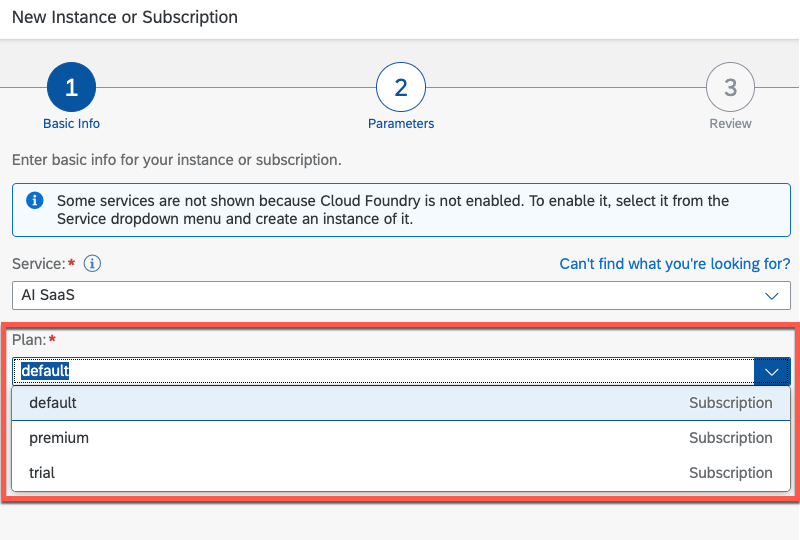
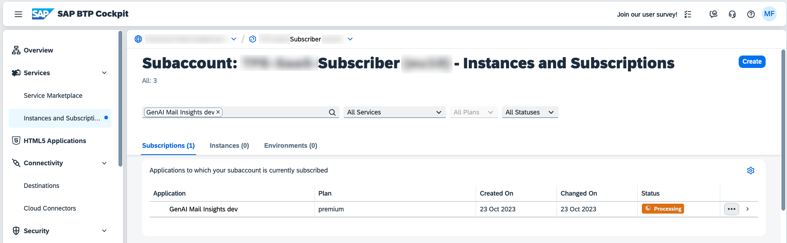
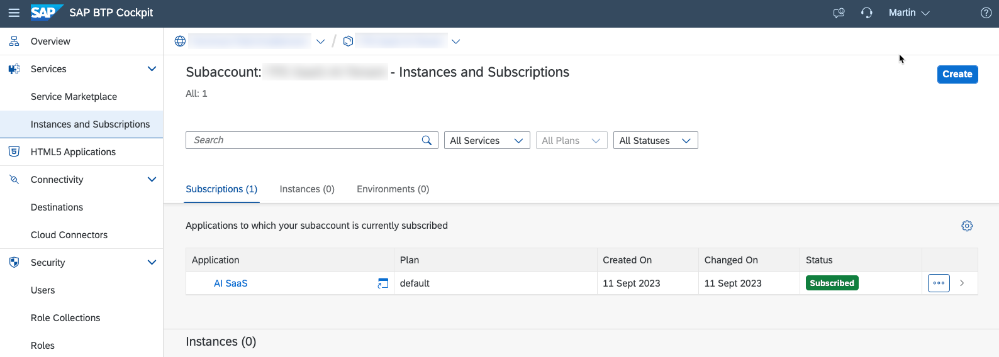
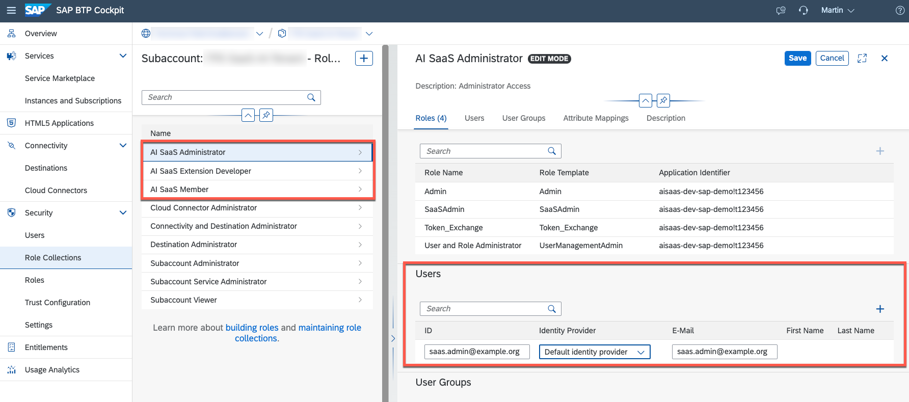
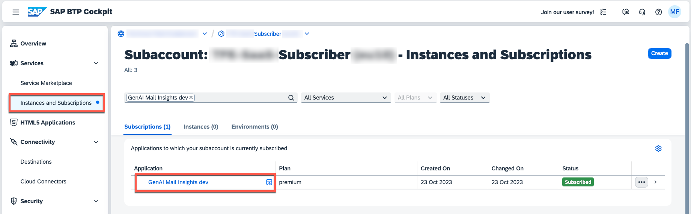

# Create a Subscription (Multitenant only)

> **Important** - This chapter is only relevant for the multitenant version of our AI Sample Scenario. In a single tenant setup, you can directly access your application using the Cloud Foundry Route or Virtual Service created for your Application Router. 

1. Create a new Subscriber Subaccount in the same SAP BTP region where your Provider Subaccount is allocated. 

2. **Do not activate** any runtime such as Cloud Foundry or Kyma. 

3. Switch to the **Instances and Subscriptions** menu and create a new Subscription for your SaaS solution.

4. Depending on your runtime, the name of your solution should be as follows. The additional details such as the Kyma Namespace or Cloud Foundry Org have been added to ensure the uniqueness of your application within the respective SAP BTP region. 

    

    **Kyma** - \<HelmReleaseName>-\<KymaNamespace>-\<KymaShootName>

    > **Example** - aisaas-default-a1b2c3

    **Cloud Foundry** - **aisaas**-\<CloudFoundrySpace>-\<CloudFoundryOrg>

    > **Example** - aisaas-dev-sap-demo

5. Select a plan of your choice and click on **Create**. In Kyma, you can specify custom **Subdomain** for your tenant by clicking on **Next**.

    

6. Your SaaS subscription will be created in the Subscriber Subaccount. Wait until the **Status** changes to **Subscribed**. 

    

    

7. Please continue by assigning the new **Role Collections** to your dedicated Subscriber SaaS administrator.

    

8. You can now continue opening the SaaS subscription from the **Instances and Subscriptions** menu. 

    

    