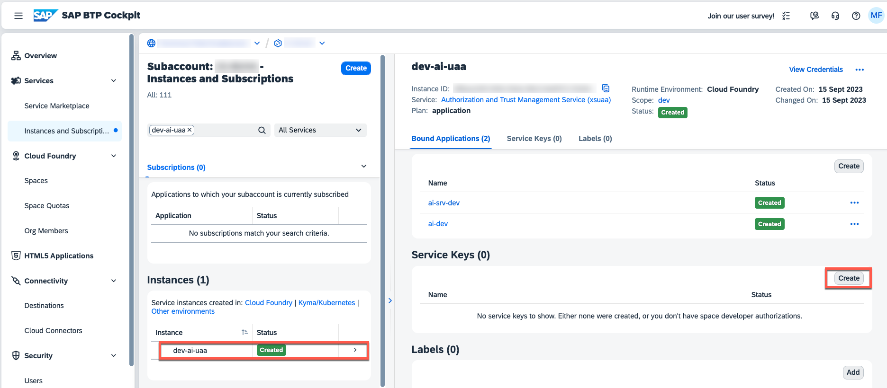
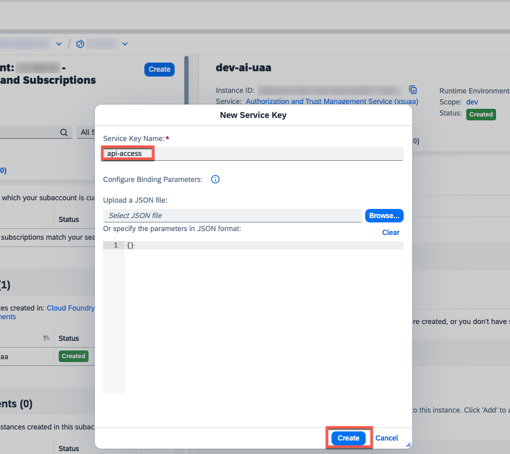
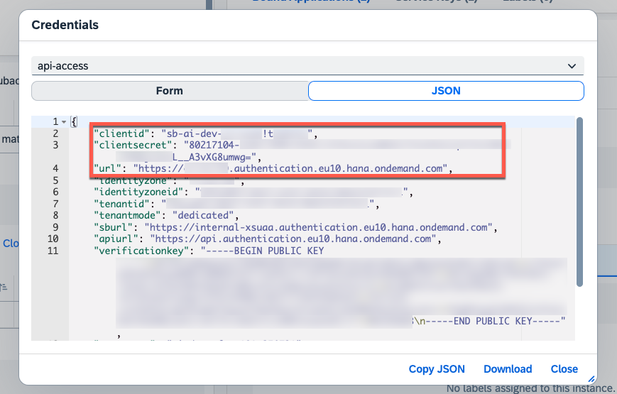
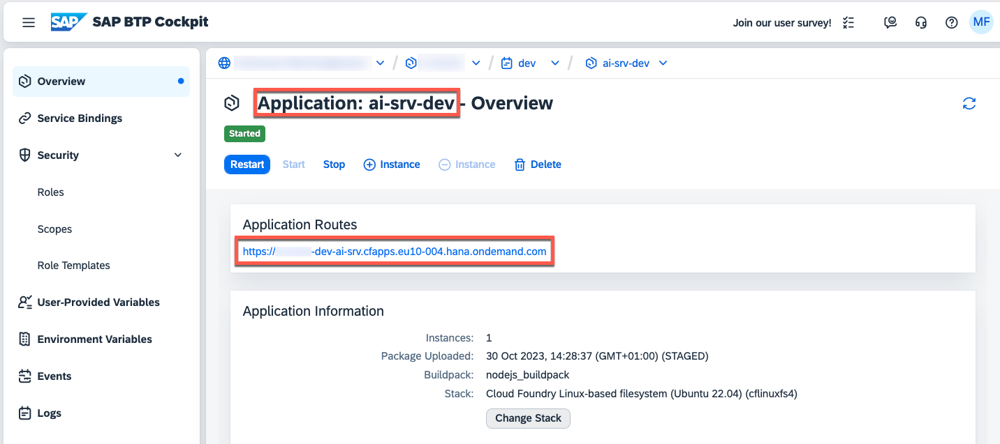

# Push Sample Mails

In this chapter you will learn, how to push sample mails to GenAI Mail Insights.

1. Find the provided **http** sample file [**requests-btp.http**](../../../single-tenant/code/test/requests-btp.http), containing a few test mails for processing.

   > **Hint** - You might need to install the **REST Client** extension in your development environment. You can find respective extensions for popular editors such as Visual Studio Code.

2. Duplicate and rename the file to **requests-btp-private.http** to ensure that your credentials are not accidentally being committed to GitHub.

   [](./images/TEST_PrivateFile.png?raw=true)

3. Update the variables in the very beginning of the **http** test file using the existing **xsuaa** Service Instance and **route** created for your CAP Application as _btpAppHostname_ value.

   Service Key of XSUAA Service Instance

   [](./images/ST_CFDetails03.png?raw=true)
   [](./images/ST_CFDetails04.png?raw=true)
   [](./images/ST_CFDetails05.png?raw=true)

   Route of CAP Application

   [](./images/ST_CFDetails06.png?raw=true)

   ```md
   @xsuaaHostname = <uaa.url>
   @btpXsuaaClient = <uaa.clientid>
   @btpXsuaaSecret = <uaa.clientsecret>
   @btpAppHostname = <CAP-Route>
   ```

4. Execute the **GET XSUAA TOKEN** request by clicking on **Send Request**.

   ```http
   ### GET XSUAA TOKEN

   # @name getXsuaaToken
   POST {{xsuaaHostname}}/oauth/token
   Accept: application/json
   Content-Type: application/x-www-form-urlencoded
   Authorization: Basic {{btpXsuaaClient}}:{{btpXsuaaSecret}}

   client_id={{btpXsuaaClient}}
   &client_secret={{btpXsuaaSecret}}
   &grant_type=client_credentials
   ```

5. Once you successfully retrieved a token issued by XSUAA, please scroll down and execute the **ADD MAILS I** request. The processing will take a while, so please wait until the request returns a result. The request will automatically inject the token retrieved from XSUAA.

   > **Important** - For single-tenant scenarios, please use the **odata/v4/mail-insights** path instead of the **rest/api/mail-insights** path as indicated below. Replace the POST endpoint manually as depicted in the example below.

   ```sh
   ### ADD MAILS I
   @token = {{getXsuaaToken.response.body.$.access_token}}

   # @name addMailsI
   POST {{btpAppHostname}}/rest/api/mail-insights/addMails # Multi-tenant
   POST {{btpAppHostname}}/odata/v4/mail-insights # Single-tenant
   content-type: application/json
   Authorization: Bearer {{token}}

   {
       "mails":[
           {
               "subject": "Disney World trip",
               "body": "Hello. I'm trying to book ...Lisa Brown",
               "sender": "lisa.brown@example.org"
           },
       ...
   ```

6. Continue with the **ADD MAILS II** and **ADD MAILS III** requests to add further sample mails to your application. Injecting the sample mails has been split into three parts, given the token limit of the Large Language Model being used. Please run the three **ADD MAILS** requests sequentially.

7. Once all sample mails have been processes successfully, please continue with the next chapter to assign the required role collection before opening the GenAI Mail Insights application ([click here](./4-TestApplication.md)).
