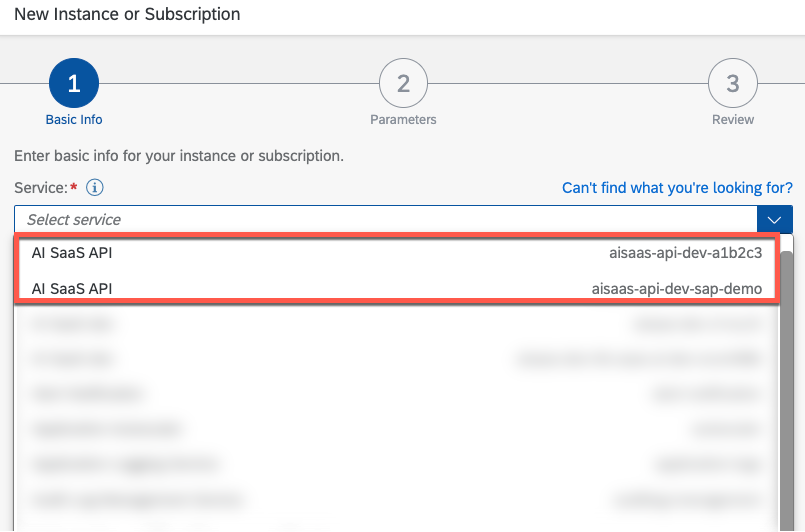
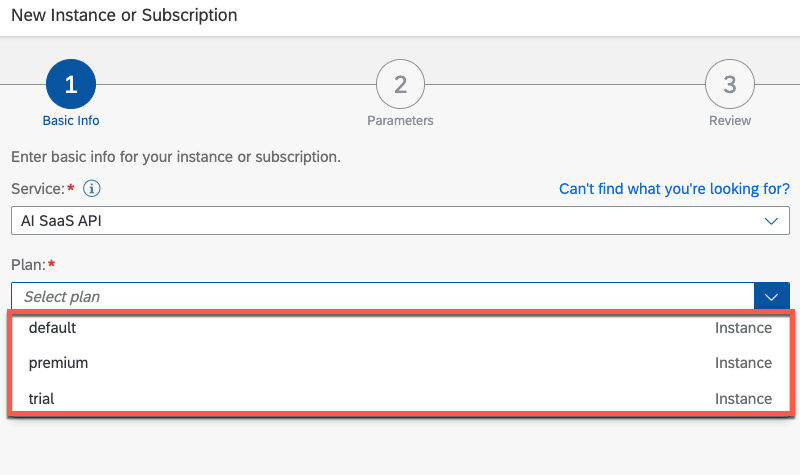
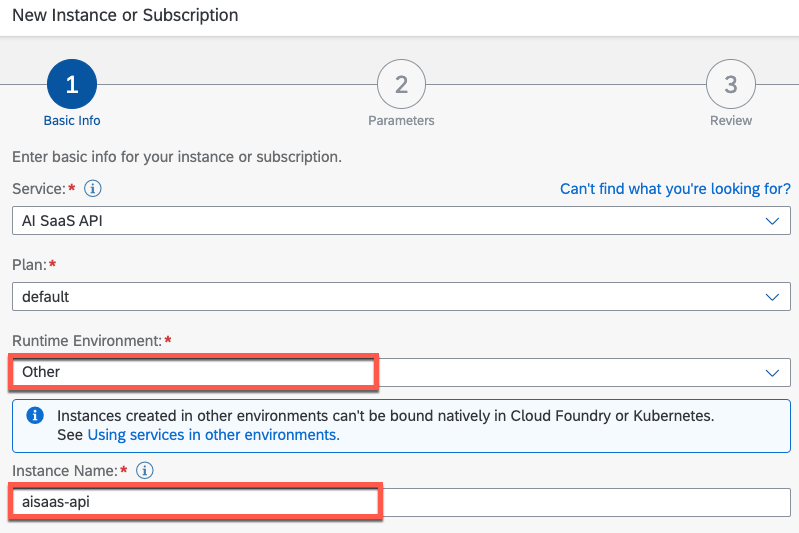
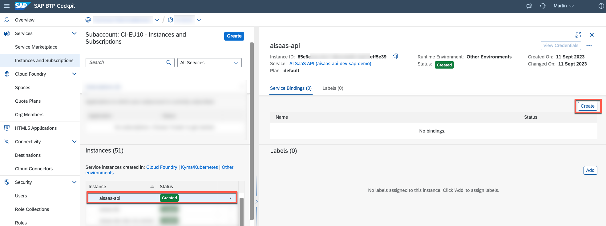
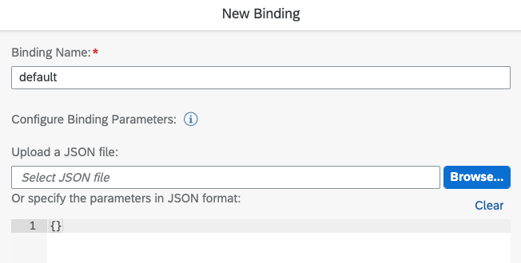
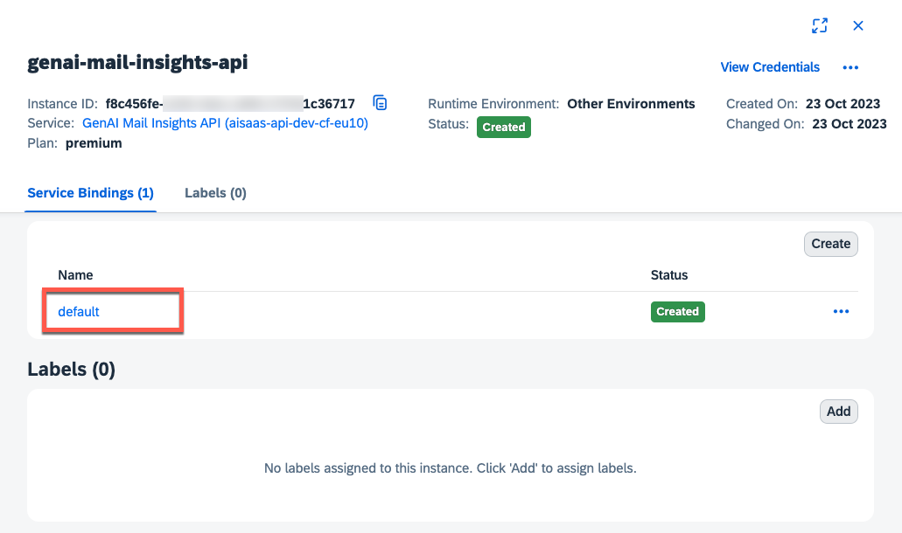
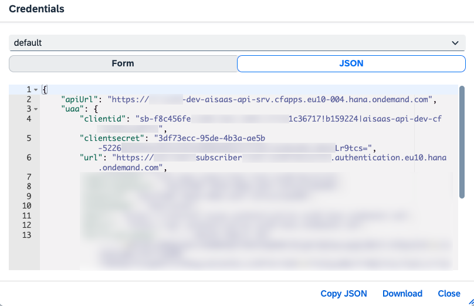

# Create an API Service Instance

Follow the next steps to create a new API Service instance within a dedicated Subscriber Subaccount. The actual API Service Broker was registered during the Provisioning/Onboarding process of the SaaS application.

1. Go to the Subscriber Subaccount in which you have created the SaaS application subscription.

2. Switch to the **Instances and Subscriptions** menu and create a new SaaS API Service instance.

3. Depending on your runtime, the name of the API Service should be as follows. The additional details such as the Kyma Namespace or Cloud Foundry Org have been added to ensure the uniqueness of your application within the respective SAP BTP region. 
   
   > **Hint** - If you cannot see your API Service in the list of available services, please double-check the logs of your SaaS application service. Most probably, the process failed due to missing credentials. 

    

    **Kyma** - \<HelmReleaseName>-api-\<KymaNamespace>-\<KymaShootName>

    > **Example** - aisaas-api-default-a1b2c3

    **Cloud Foundry** - **aisaas**-api-\<CloudFoundrySpace>-\<CloudFoundryOrg>

    > **Example** - aisaas-api-dev-sap-demo

4. Select a **Service Plan** of your choice, choose **Other** Environment and give your API Service Instance a name of your choice. Click on **Create** to setup the service instance. 

    

    

5. Wait until the **Status** changes to **Created** and **Create** a new **Service Binding** for the new Service Instance. 

    

6. Give your Service Binding a meaningful name of your choice and click on **Create**.

    

7. Once the Service Binding is created, you can access the binding details and credentials by click on the Service Binding. 

    

    

8. The respective credentials and URLs will be required when pushing e-mails to the Subscriber instance of the SaaS application.

    