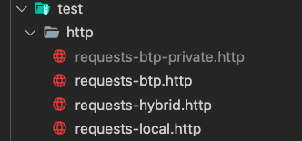

# Push sample mails

In this chapter you will learn, how SaaS Subscribers can push sample mails to their SaaS instance using the SaaS API. 

1. Find the provided **http** sample file **requests-btp.http** ([click here](../../../code/test/http/requests-btp.http)), containing a few test mails for processing. 
   
   > **Hint** - You might need to install the **REST Client** extension in your development environment!
   
2. Cope and rename the file to **requests-btp-private.http** to ensure that your credentials are not accidentally being committed to GitHub. 

    [](./images/TEST_PrivateFile.png?raw=true)

3. Update the variables in the very beginning of the **http** test file. In a multitenant scenario, you can find the required values in the **Service Binding** which you created in the **Create API Service** ([click here](./2-CreateAPIService.md)) chapter of this tutorial. 
   
   > **Important** - In a single tenant setup, you can just use an existing Service Binding or new Service Key of your **xsuaa** service instance and use the default **Cloud Foundry Route** or **Kyma Virtual Service** created for your CAP Application as *btpAppHostname* value. 

    ```md
    @xsuaaHostname = <uaa.url>
    @btpXsuaaClient = <uaa.clientid>
    @btpXsuaaSecret = <uaa.clientsecret>
    @btpAppHostname = <apiUrl>
    ```

4. Execute the **GET XSUAA TOKEN** request by clicking on **Send Request**.

    ```http
    ### GET XSUAA TOKEN

    # @name getXsuaaToken
    POST {{xsuaaHostname}}/oauth/token
    Accept: application/json
    Content-Type: application/x-www-form-urlencoded
    Authorization: Basic {{btpXsuaaClient}}:{{btpXsuaaSecret}}

    client_id={{btpXsuaaClient}}
    &client_secret={{btpXsuaaSecret}}
    &grant_type=client_credentials
    ```

5. Once you successfully retrieved a token issued by XSUAA, please scroll down and execute the **ADD MAILS I** request. The processing will take a while, so please wait until the request returns a result. The request will automatically inject the token retrieved from XSUAA. 
   
   > **Important** - For single-tenant scenarios, please use the **odata/v4/mail-insights** path instead of the **rest/api/mail-insights** path as indicated below. 

    ```http
    ### ADD MAILS I
    @token = {{getXsuaaToken.response.body.$.access_token}}

    # @name addMailsI
    POST {{btpAppHostname}}/rest/api/mail-insights/addMails
    content-type: application/json
    Authorization: Bearer {{token}}

    {
        "mails":[
            {
                "subject": "Disney World trip",
                "body": "Hello. I'm trying to book ...Lisa Brown",
                "sender": "lisa.brown@example.org"
            },
        ...
    ```

6. Continue with the **ADD MAILS II** and **ADD MAILS III** requests to add further sample mails to your application. Injecting the sample mails has been split into three parts, given the token limit of the Large Language Model being used. Please ensure to run the three **ADD MAILS** requests sequentially. 

7. Once all sample e-mails have been processes successfully, please continue with the next chapter to assign the required role collection before opening the GenAI Mail Insights application.
