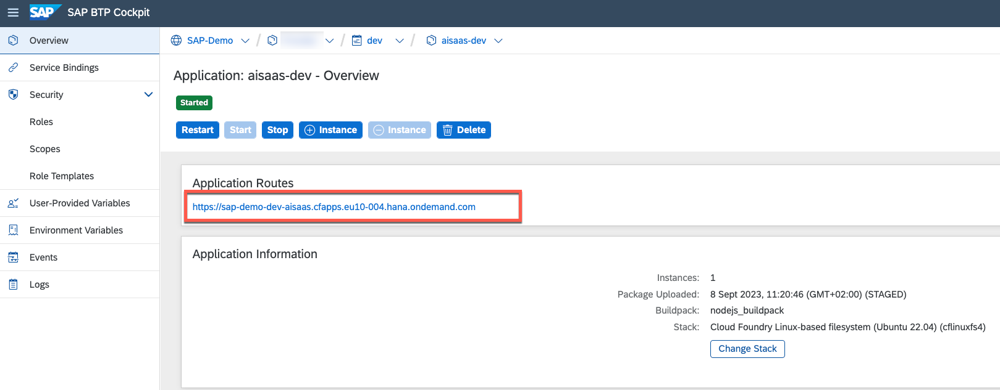

# Test the Application

In this part of the tutorial, you will learn how to test the AI Sample application.

1. In a **multitenant** context, please ensure that you subscribed to the AI Sample application as described in the previous chapters ([click here](./1-CreateSubscription.md)). 
   
   > **Hint** - Ideally, you also used the SaaS API to upload and process our sample mails as described in the previous chapter ([click here](./3-PushSampleMails.md)).

2. In a **multitenant** context, please switch to the **Instances and Subscriptions** menu and open the AI SaaS subscription. 
   
   

   In a **single-tenant** scenario, you can just open the Cloud Foundry Route or Virtual Service of your Application Router. 

   

3. In the application, you will either see the pre-processed sample mails or you can upload a new e-mail using the respective upload button. 

4. You can now select one of the mails in the list and check out the different features offered by the SaaS sample application.