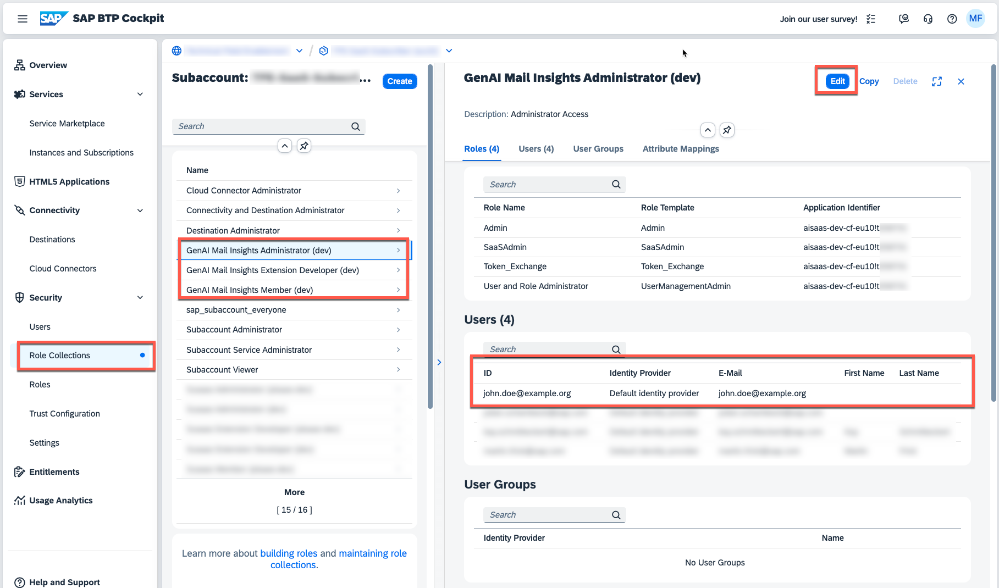
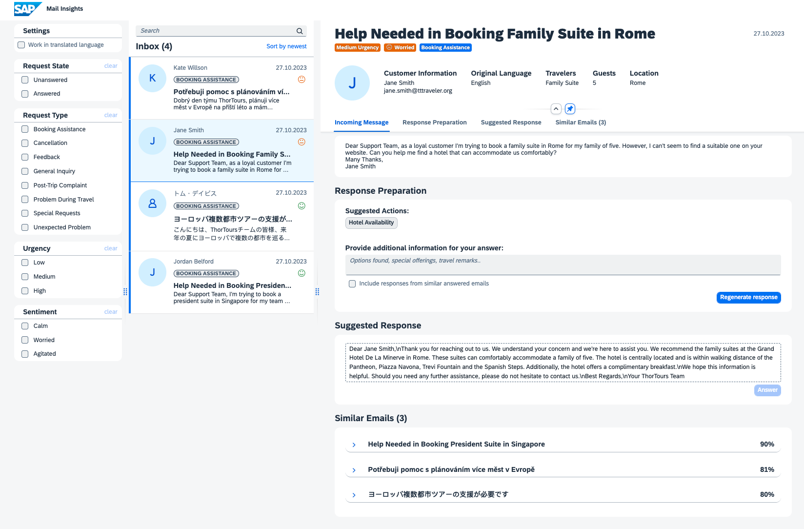
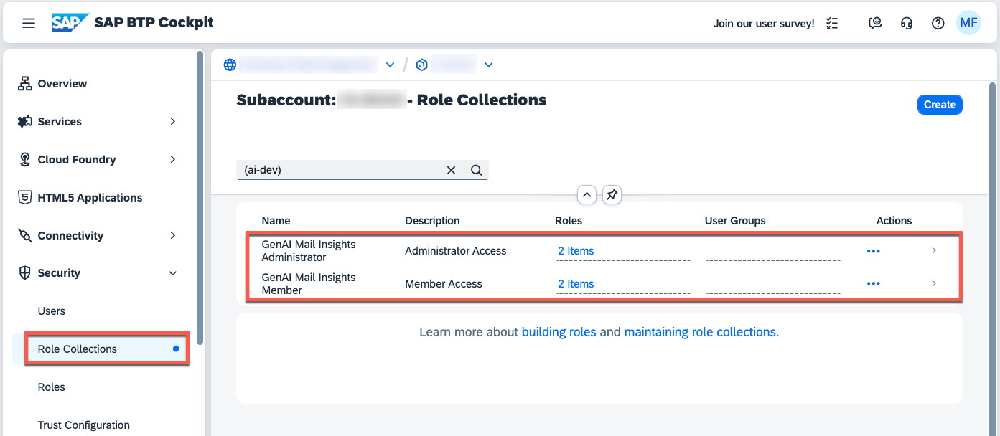

# Test the GenAI Mail Insights Sample Application

In this part of the tutorial, you will learn how to test the GenAI Mail Insights Sample Application.

## Multitenant

1. In a **multitenant** context, please ensure that you subscribed to the GenAI Mail Insights Sample application as described in the previous chapters ([click here](./1-CreateSubscription.md)). 

2. In your SAP BTP Cockpit, switch to your **Role Collections** menu and assign the **GenAI Mail Insights Administrator** or **Member** role collection to your own user. 

   

3. In a **multitenant** context, please switch to the **Instances and Subscriptions** menu and open the GenAI Mail Insights subscription. 
   
   

4. In the application, you will see the pre-processed sample e-mails. 

   > **Hint** - Ideally, you also used the GenAI Mail Insights API to upload and process our sample mails as described in the previous chapter ([click here](./3-PushSampleMails.md)). Otherwise you will not see any processed mails and need to add them manually using the respective button.

   

5. You can now select one of the mails in the list and check out the different features offered by the GenAI Mail Insights Sample application.

## Single-Tenant

1. In your SAP BTP Cockpit, switch to your **Role Collections** menu and assign the **GenAI Mail Insights Administrator** or **Member** role collection to your own user. 

   

2. In a **single-tenant** scenario, you can just open the default Cloud Foundry Route or API Rule of your GenAI Mail Insights Application Router. 
   
   > **Hint** - Ideally, you also used the **addMails** endpoint of your CAP service to upload and process our sample mails as described in the previous chapter ([click here](./3-PushSampleMails.md)). Otherwise you will not see any processed mails and need to add them manually using the respective button.

   

3. In the application, you will see the pre-processed sample e-mails. 

    

4. You can now select one of the mails in the list and check out the different features offered by the GenAI Mail Insights Sample application.