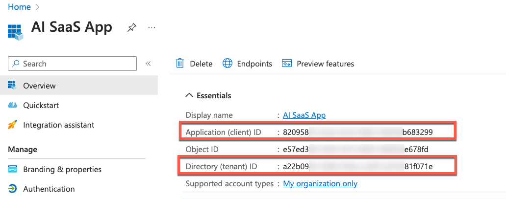

# Use a Shared Office365 Inbox (Optional)

In this chapter you will learn, how to use a shared Office365 inbox instead of manually pushing e-mails using the SaaS API. Microsoft provides a free test/trial period for their services, you if you do not have access to an Azure account yet, you can set up a free instance. 


## Setting up a free Azure Subscription

1. Open your web browser and navigate to the Azure free account page: https://azure.microsoft.com/en-us/free/

2. Click on the "Start free" button.

3. Sign in using a Microsoft account. If you don't have one, you'll have to create it. This will involve providing an email address, creating a password, and providing some personal information. 

4. Once you've signed in, you'll need to verify your identity through phone verification. Enter your phone number and click "Next". You'll receive a text message with a code. Enter this code on the next page and click "Verify".

5. Next, you'll need to provide a valid credit card for verification. Microsoft uses this to verify your identity and prevent fraudulent use. Note that you won't be charged unless you manually upgrade your account to a paid version.

6. After entering your credit card information, select "Next". 

7. On the next page, you'll need to agree to the subscription Agreement, Privacy Statement, and offer details. Check the box that says "I agree", and then select "Sign up".

8. Wait a few moments while your account is being set up. Once it's ready, you'll be taken to the Azure dashboard. 


## Creating a Shared Mailbox

1. Go to the Office 365 admin center: https://admin.microsoft.com

2. On the left navigation pane, select "Groups" and then "Shared mailboxes".

3. On the Shared mailboxes page, select "+ Add a mailbox".

4. In the "Add a shared mailbox" dialog box, give your shared mailbox a name. Make sure the email name is unique and then click "Add".

5. After the mailbox is created, you can select it on the Shared Mailboxes page and add users to it. Click on "Add members" and select the users you want to be able to access the shared mailbox.


## Creating an Application in Azure AD

1. In your Azure dashboard, find and select "Azure Active Directory".

2. In the left-hand menu, select "App registrations", then "New registration".

3. Fill in the name for your application, select the supported account types, and specify a redirect URI if necessary. Then click "Register".

4. After the app is created, you will be redirected to the application dashboard. Here, you can find your Application (client) ID and Directory (tenant) ID. 


## Providing Permissions to the Application

> **Hint** - This tutorial uses Application Permissions and an Admin Consent, which not necessarily the most elegant option to solve this requirement. In a productive scenario, please familiarize yourself with Azure Delegate Permissions and use dedicated Authorization Code flows. 

1. In your application dashboard, select "API permissions", then "+ Add a permission".

2. In the panel that opens, select "Microsoft Graph", "Application Permissions" and type in "Mail.Read".

3. Select the "Mail.ReadWrite" permission and click on "Add permissions" to save your changes.

4. After adding the permissions, click on the "Grant admin consent for [your directory]" button to grant the permissions for the whole directory. This action requires an account with the Global Administrator role.

    > **Important** - Please ensure you limit the access of the application to the Shared Mailbox created a few steps ago. Otherwise, the respective Client Credentials can be used to read the inboxes of all e-mail accounts. 
    You can find the respective tutorial in the official Microsoft Documentation ([click here](https://learn.microsoft.com/en-us/graph/auth-limit-mailbox-access)).  


## Creating the Required Client Credentials

1. In your application dashboard, select "Certificates & secrets".

2. Click "+ New client secret".

3. Add a description for your client secret, select a duration, and then click "Add".

4. After you click "Add", the value of the client secret will be displayed. Make sure to copy this value - you won't be able to retrieve it after you leave this page.


## Create a new Destination in Subscriber Subaccount

1. Go to your SAP BTP Subscriber Subaccount and create a new Subaccount Level Destination, using the Client Secret you just created and the details of your Application Registration Overview. 

    [](./images/AZR_AppReg.png?raw=true)

    ```md
    # Default Settings
    Type = HTTP
    Client Id = <Application(client)ID>
    Client Secret = <ClientSecret>
    Authentication = OAuth2ClientCredentials
    Name = SUBSCRIBER_OFFICE365_DESTINATION
    Token Service URL = https://login.microsoftonline.com/<Directory(tenant)ID>/oauth2/v2.0/token?grant_type=client_credentials
    Proxy Type = Internet
    URL = https://graph.microsoft.com/v1.0/users/<SharedInboxEmailAddress>
    Token Service URL Type = Dedicated

    # Additional Field
    scope=https://graph.microsoft.com/.default
    ```

2. You can now use the respective synch feature of your SaaS application to fetch the e-mails from your Shared Azure Inbox. 
   
    > **Hint** - In this simple scenario, only 10 e-mails are being fetched from the Inbox. Please check the Microsoft Graph API documentation ([click here](https://learn.microsoft.com/en-us/graph/api/user-list-messages)) to learn how to increase this limit or how to use pagination.

3. Existing e-mails which have already been imported from your shared inbox, will overwrite existing records in your SAP HANA Cloud database as well as your PostgreSQL instance. 

    > **Hint** - You might consider a different logic in a productive scenario, only fetching the most recent e-mails. 